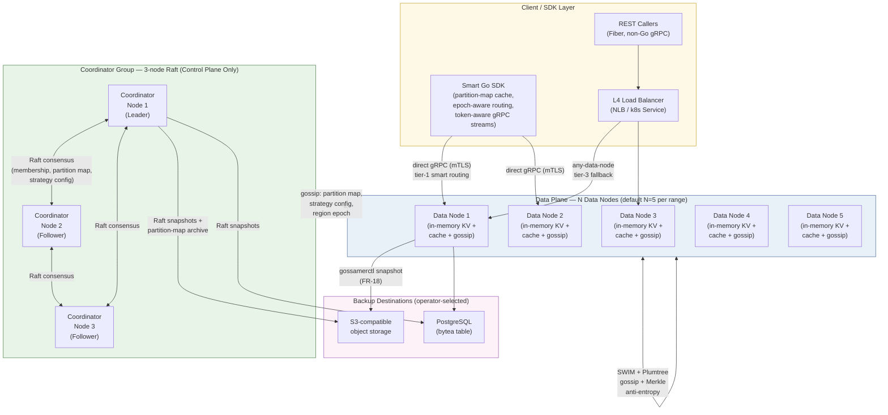
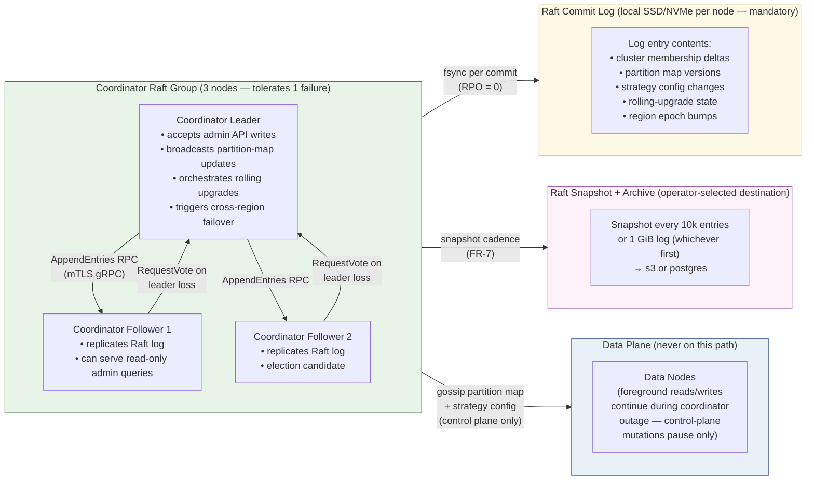
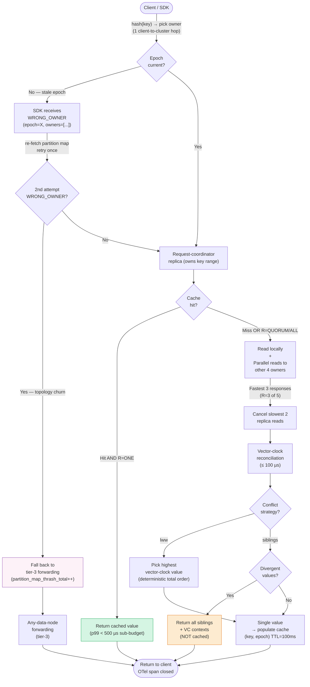
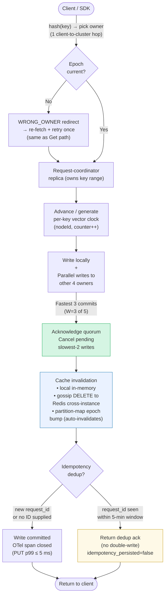
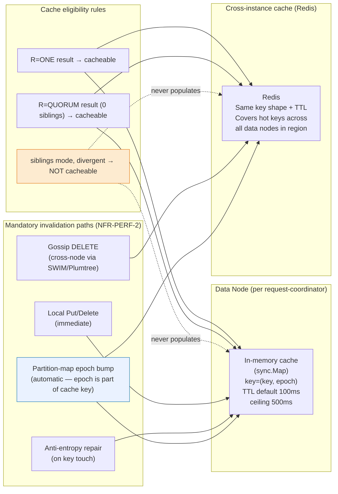
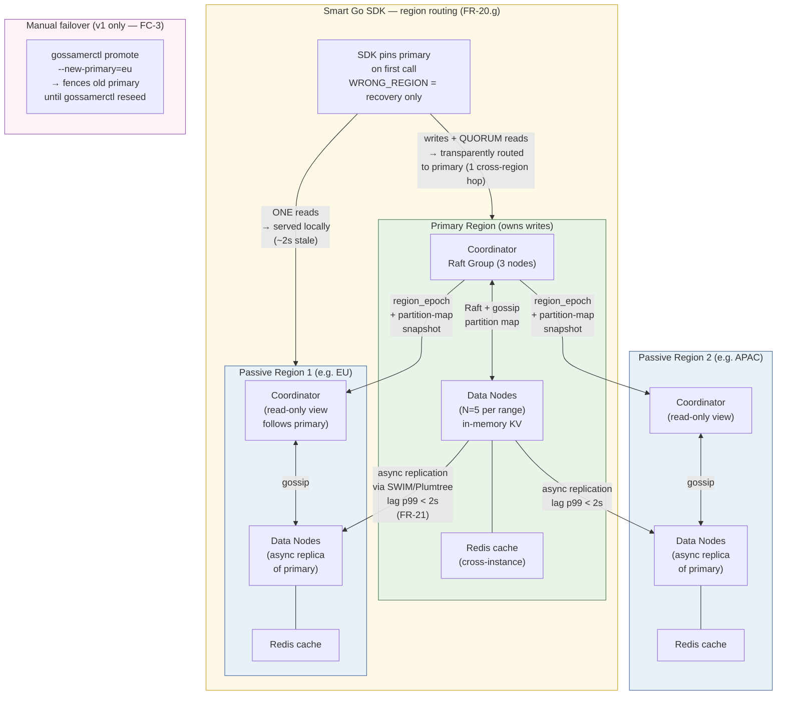
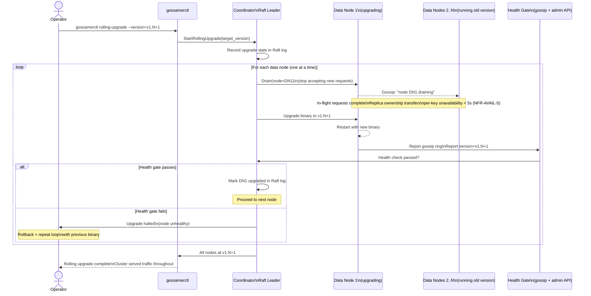
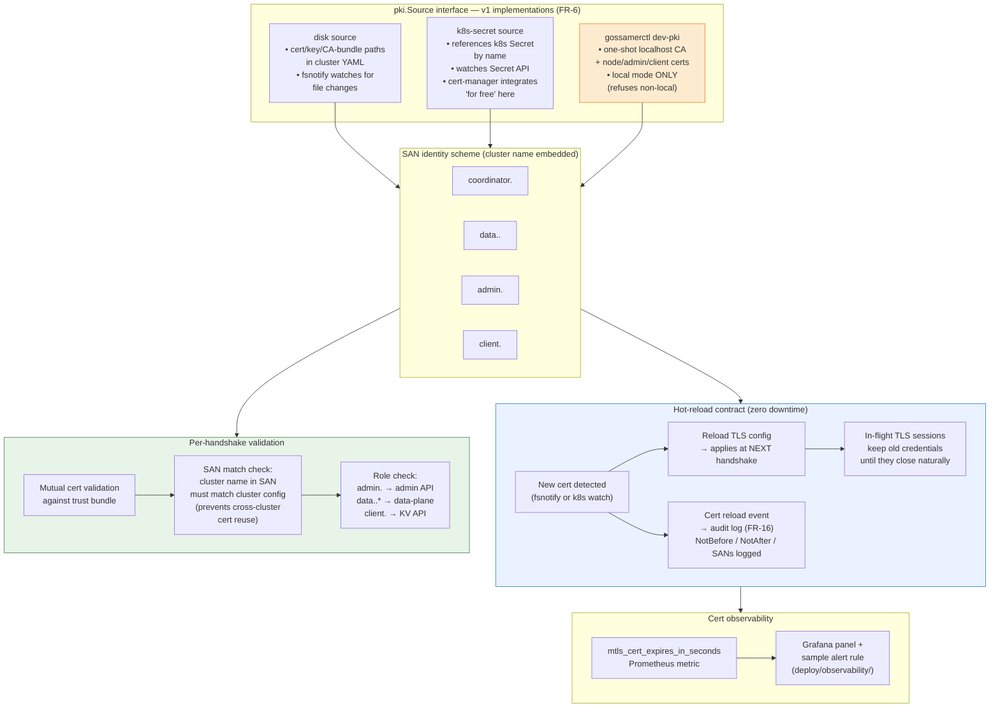
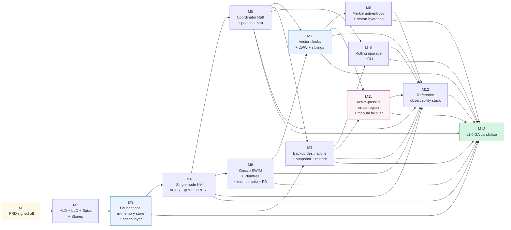

# GossamerDB — Product Requirements Document

**Author:** Archit Agarwal

**Status:** Draft v1.9 — DM-4 resolved: FR-15 now locks the post-restart observable contract (2xx + re-apply), names `TestIdempotencyAfterNodeRestart` as the acceptance test, and adds `idempotency_dedup_miss_total` to the FR-11 metrics surface. §14 trimmed to the 11 still-open DM gaps (resolved DMs moved to revision history for the audit trail). Carries forward all v1.8 content. See revision history for full changelog.

**Upstream input:** `docs/wiki/gossamerdb.md`

**Project rules:** `CLAUDE.md`

**Next document:** the HLD at `docs/hld/gossamerdb.md` (HLD → LLD → Epics → Stories), pending design sign-off

**Release target:** v1.0 GA (single coordinated release; v1.x increments listed in §10)

### Revision history

| Date       | Rev  | Change                                                                                                                                                                                                                                                                                                                                                                                                                                                                                                                                                                                                                                                                                                                                                                                                                                                                                                                                                                                                                                                                                                                                                                                                                                                                                                                                                                                                                                                                                                                                                                   | Driver         |
| ---------- | ---- | ------------------------------------------------------------------------------------------------------------------------------------------------------------------------------------------------------------------------------------------------------------------------------------------------------------------------------------------------------------------------------------------------------------------------------------------------------------------------------------------------------------------------------------------------------------------------------------------------------------------------------------------------------------------------------------------------------------------------------------------------------------------------------------------------------------------------------------------------------------------------------------------------------------------------------------------------------------------------------------------------------------------------------------------------------------------------------------------------------------------------------------------------------------------------------------------------------------------------------------------------------------------------------------------------------------------------------------------------------------------------------------------------------------------------------------------------------------------------------------------------------------------------------------------------------------------------ | -------------- |
| 2026-04-27 | v1.0 | Initial PRD from the requirements wiki; 20/20 open questions resolved with delivery-realistic defaults.                                                                                                                                                                                                                                                                                                                                                                                                                                                                                                                                                                                                                                                                                                                                                                                                                                                                                                                                                                                                                                                                                                                                                                                                                                                                                                                                                                                                                                                                  | Archit Agarwal |
| 2026-04-28 | v1.1 | Q1 (workload shape & scale) confirmed by user with concrete numbers: 1M cluster QPS, 1k per-key QPS, GET p50/p95/p99 = 100 µs / 200 µs / < 1 ms (request-level), PUT p50/p95/p99 = 500 µs / 1 ms / 5 ms, replication `N=5, W=3, R=3`. Cascaded into FR-2, NFR-PERF-1a/1b, NFR-SCALE-2/3/3a/7, NFR-AVAIL-4, the §4.1 budget table, and the Q4 row. GET p99 budget moved from cache-only to **request-level**.                                                                                                                                                                                                                                                                                                                                                                                                                                                                                                                                                                                                                                                                                                                                                                                                                                                                                                                                                                                                                                                                                                                                                             | Archit Agarwal |
| 2026-04-28 | v1.2 | Q2 (Coordinator HA model) confirmed and expanded by user: 3-node embedded Raft, strictly control-plane (off the data path), RTO < 30 s, RPO 0, 99.95% availability, total coordinator outage pauses control-plane mutations only — reads/writes continue. Cascaded into the §11 Q2 row; FR-7 / FR-8 / NFR-AVAIL-1 / NFR-AVAIL-3 already captured this stance and are referenced from Q2.                                                                                                                                                                                                                                                                                                                                                                                                                                                                                                                                                                                                                                                                                                                                                                                                                                                                                                                                                                                                                                                                                                                                                                                 | Archit Agarwal |
| 2026-04-28 | v1.3 | Q3 (Coordinator vs data-node responsibilities — data-plane routing topology) confirmed by user. Three-tier preference order locked: (1) **smart Go client SDK** with token-aware routing direct to an owning replica, (2) **coordinator-as-replica** fan-out with fastest-3-of-5 wins, (3) **any-data-node forwarding fallback** for REST / non-Go callers. Stateless router tier deferred to v1.x. Cascaded into FR-8 (rewritten), new **FR-20** (smart Go client SDK), §6.2 Request lifecycle (rewritten), §8 risk **R9** (partition-map staleness), and the §11 Q3 row.                                                                                                                                                                                                                                                                                                                                                                                                                                                                                                                                                                                                                                                                                                                                                                                                                                                                                                                                                                                               | Archit Agarwal |
| 2026-04-28 | v1.4 | Q4 (Quorum semantics & defaults) confirmed by user — **Option C** chosen: cluster config owns the numerics (`N`, `W`, `R`); per-request consistency is **named only** (`{ONE, QUORUM, ALL}`), no arbitrary numeric R/W tuples allowed at the API surface. Default per-request consistency = `QUORUM`. Default cluster numerics = `N=5, W=3, R=3` (already locked in v1.1). Cascaded into FR-2 (rewritten — "explicit R/W tuples" clause dropped), J-A-1 (request-option syntax updated), FR-20 (SDK accepts named consistency), and the §11 Q4 row. Wiki §9.1 expanded; §9.2 renumbered to 16 items.                                                                                                                                                                                                                                                                                                                                                                                                                                                                                                                                                                                                                                                                                                                                                                                                                                                                                                                                                                     | Archit Agarwal |
| 2026-04-29 | v1.5 | **Q9 (auth) and Q10 (compliance + residency) closed.** Q9: mTLS-identity-only auth surface for v1 confirmed; added forward-compat `principal` hook (handshake-derived, pinned to connection, threaded through every handler, emitted on FR-16 audit log + OTel spans) so v1.1 RBAC plugs in without a wire change. Capability tokens / JWT explicitly rejected for v1 on hot-path-cost grounds. Q10 split into (a) certifications and (b) residency: no certs in v1 with a SOC2 CC-series mapping doc shipped instead; **cluster-level data residency** added as NFR-SEC-7 + new §6.5 Data residency model. New NG10 (no application-layer compliance features). Cascaded into FR-16 (audit schema with `principal`, `key_hash`, region events), FR-20 (new clause h on principal surfacing), §11 Q9 (full rewrite with rejected alternatives expanded), §11 Q10 (full rewrite split into certifications + residency), §1.2 NG10 added, §4.4 NFR-SEC-7 added, §6.5 added, OD-2 resolved-with-residual-marketing-signoff. Wiki §9.2 #1 and #2 moved to §9.1; stale §9.2 items 3–6 also moved to §9.1 since the PRD already resolves them in Q12/Q15/Q19/Q20. Three new SLO risks added (R10–R12).                                                                                                                                                                                                                                                                                                                                                                         | Archit Agarwal |
| 2026-04-30 | v1.6 | **Ambiguity sweep A1–A7 folded in + SLO-bite features tightened.** **A1** cache contract for `R=QUORUM` reads locked into FR-12, NFR-PERF-2, and §6.3 — cache key is `(key, partition_map_epoch)` with default TTL 100 ms / ceiling 500 ms; both `ONE` and `QUORUM` results populate the cache; `siblings` divergent results are non-cacheable. **A2** FR-15 idempotency dedup explicitly noted as in-memory + does-not-survive-restart, with an `idempotency_persisted` SDK metric. **A3** NFR-PERF-3 hydration burst budget (50%/50% for up to 10 min, ceiling 30 min) so cold-restart nodes refill quickly while peers throttle outbound to a `node_role=hydrating` peer. **A4** FR-20.d second-`WRONG_OWNER` falls back to FR-8 tier 3 with `partition_map_thrash_total` metric. **A5** FR-19 rate-limit subject = cert serial + issuer DN (not SAN), 8-way sharded buckets, `BenchmarkHotPrincipalGet` bench-gates the < 1 ms p99 under saturation. **A6** FR-7 Raft snapshot cadence = 10k entries or 1 GiB log; SSD/NVMe required for the Raft log volume. **A7** FR-21 region-epoch propagated on every gossip message symmetric with partition-map epoch; SDK refresh is identical to `WRONG_OWNER`. Plus FR-20.g now mandates **primary-region auto-discovery + steady-state pinning** so passive-misrouting is a recovery path, not a steady-state cost. **R1 strengthened** with explicit HLD measurement plan for parallel-3-of-5 GET QUORUM (dispatch / network / reconcile / marshal sub-budgets) and a binding `BenchmarkGetQuorumRequestLevel` GA gate. | Archit Agarwal |
| 2026-05-01 | v1.7 | **Delivery Manager review pass.** Added 8 Mermaid architecture diagrams to §6 (system topology, coordinator Raft HA, Get/Put request lifecycle, cache invalidation flow, active-passive multi-region topology, rolling upgrade sequence, mTLS/PKI flow) and milestone dependency DAG to §7. Added new §6.4 (active-passive multi-region topology) fixing the §6 numbering gap. Added §14 (DM review — 20 identified gaps). Applied 5 immediate fixes: OD-1 stale default updated to v1.1-confirmed 1M ops/s numbers (DM-12); OD-6 needs-by moved from `pre-LLD` to `pre-HLD` (DM-13); FR-21 replication backlog cap locked to 500 MiB / 30 s defaults (DM-8); §9 GA criteria clarified which SHOULD-level FRs are GA-blocking vs GA-aspirational (DM-11); §13 Hand-off updated with two required runbook deliverables (DM-14, DM-15). Remaining 15 DM gaps are recorded in §14 for the Architect and EM to address before HLD sign-off.                                                                                                                                                                                                                                                                                                                                                                                                                                                                                                                                                                                                                                  | Archit Agarwal |
| 2026-05-01 | v1.8 | **DM-3 resolved.** FR-7 now locks a **provisional Raft-log IOPS floor of ≥ 3,000 IOPS sustained 4 KiB random write with fsync** (measured by `fio --rw=randwrite --bs=4k --fdatasync=1 --iodepth=1`), making the SSD/NVMe disk requirement testable at GA. The cluster-bootstrap pre-flight in FR-13 MUST refuse to initialize a coordinator whose `fio` probe falls below the floor. Added new **OD-7** (Outstanding Decision) capturing the floor as a `pre-HLD` default with a `pre-LLD` open question on whether the floor needs to rise based on measured Raft commit-loop fsync latency under target load. §14 DM-3 marked RESOLVED.                                                                                                                                                                                                                                                                                                                                                                                                                                                                                                                                                                                                                                                                                                                                                                                                                                                                                                                               | Archit Agarwal |
| 2026-05-02 | v1.10 | **DM-1, DM-2, DM-5 resolved.** **DM-1:** §9 J-O-1 entry expanded into a 3-row table naming `TestClusterBringUpLocal` (60 s, every-PR), `TestClusterBringUpK8s` (3 min, nightly + pre-merge `develop`), and `TestClusterBringUpMultiRegionAWS` (10 min, pre-tag on `release/*`); codified `t0` = first coordinator `start` call, `t1` = first poll where `coordinator_quorum ∧ all_data_nodes_alive ∧ partition_map_epoch>0 ∧ gossip_converged` holds for two consecutive 5 s polls; image-pull excluded via pre-pull harness; ownership = Project Lead (CI) + Architect (sign-off). **DM-2:** FR-5 / NFR-PERF-3 now bench-gated by `BenchmarkAntiEntropyUnderLoad` (1 MiB divergent range repair under saturation foreground load) asserting four properties — GET p99 < 1 ms, PUT p99 < 5 ms, anti-entropy CPU ≤ 5%, NIC ≤ 10%; hydration variant `BenchmarkAntiEntropyHydrationBurst` enforces the 50%/50% burst caps. OD-6 taxonomy extended with the "background-work-under-load" category covering this class of bench. **DM-5:** NFR-AVAIL-2 now bench-gated by `SoakChaosReplicaKill` (`//go:build chaos`, internal/chaos/) — 72 h sustained NFR-SCALE-3 load with uniformly-random 1-of-5 replica killed every 5–15 min (15 s min recovery gap); pass thresholds R=ONE ≤ 0.01% / R=QUORUM ≤ 0.05% rolling-72h error rate, and no rolling 5-min window above 5×; nightly `SoakChaosReplicaKillSmoke` runs at 4 h with halved thresholds. Full run gates `release/*` pre-tag; smoke gates nightly. §14 trimmed: open count 11 → 8; resolved count 9 → 12 (DM-1, DM-2, DM-5 added to the resolved list). | Archit Agarwal |
| 2026-05-02 | v1.9 | **DM-4 resolved + §14 trimmed.** FR-15 now locks the **post-restart observable contract** for idempotent writes: a duplicate request landing on a freshly-restarted owner during the dedup window MUST return **2xx with re-apply** — no distinct error code, because emitting one would require persistent dedup state that v1 explicitly opted out of (A2). Added **`TestIdempotencyAfterNodeRestart`** as the named acceptance test (asserts 2xx, observable re-apply, and metric increment). Added new metric **`idempotency_dedup_miss_total`** to FR-11's standard OTel metrics surface so operators can size their own application-layer ledger needs. §14 cleaned up: the 9 already-resolved DMs (DM-3, 4, 8, 11, 12, 13, 14, 15, 20) were removed from §14 to keep the open-issues list scannable; their audit trail lives in this revision history. The 11 still-open DMs (DM-1, 2, 5, 6, 7, 9, 10, 16, 17, 18, 19) remain in §14 for the Architect and EM to address before HLD sign-off.                                                                                                                                                                                                                                                                                                                                                                                                                                                                                                                                                                     | Archit Agarwal |

> This PRD resolves the 20 open questions raised in `docs/wiki/gossamerdb.md §9`. Every resolution is recorded inline in §11 with the rejected alternatives. Items still requiring business confirmation are listed in §12 ("Outstanding Decisions") with a recommended default and a `needs-by` deadline tag.

---

## 1. Goals & Non-Goals

### 1.1 Goals (v1)

- **G1.** Ship a single distributed key-value binary set (`coordinator` + `datanode`) that runs identically on **local**, **Kubernetes**, and **multi-region AWS** with mode-specific behaviour driven only by configuration.
- **G2.** Expose `Put` / `Get` / `Delete` over both **gRPC** (primary) and **REST via Fiber** (secondary) with **per-request tunable quorum**.
- **G3.** Use a **layered, lightweight gossip stack** for membership and metadata dissemination: **region-aware SWIM** (default, mandatory) for membership + failure detection, plus optional **Plumtree** for efficient bulk dissemination of partition-map / strategy-version updates. Layers are selectable per cluster via configuration.
- **G4.** Resolve concurrent writes via **per-key vector clocks** with a **pluggable conflict-resolution strategy** (LWW default; sibling-return alternative ships in v1).
- **G5.** Run **Merkle-tree anti-entropy** as bounded background work to converge replicas without taking the cluster offline.
- **G6.** Make the cluster secure by default: **mTLS required** on every node-to-node and client-to-node hop. Plaintext is refused.
- **G7.** Provide an **HA coordinator** (3-node Raft group, embedded — see §6.1) so that a single coordinator failure does not stop the cluster.
- **G8.** Emit **OpenTelemetry** traces, metrics, and logs covering the request path, gossip, anti-entropy, and security events.
- **G9.** Support **rolling upgrades** with a one-minor-version skew window, no full-cluster downtime, and a documented rollback path.
- **G10.** Honor the project-wide **< 1 ms p99 cache-call SLO** from `CLAUDE.md` on every request-scoped read path that flows through the cache layer. Enforced by `./scripts/bench-check.sh` as a hard gate.

### 1.2 Non-Goals (v1)

- **NG1.** Not a SQL / document / search / queue product. KV semantics only.
- **NG2.** No hosted/managed offering. Self-deploy only.
- **NG3.** No client SDKs beyond **Go** in v1. Other languages can use the wire protocol (gRPC/REST) directly.
- **NG4.** No web admin UI. A CLI ships in v1; a UI is deferred.
- **NG5.** No federation with external KV systems (etcd, DynamoDB, etc.).
- **NG6.** No multi-tenant namespace isolation in v1 — single-tenant per cluster (§11 Q18).
- **NG7.** No active-active multi-region writes in v1. Multi-region in v1 is **cluster-level active-passive** with async cross-region replication; one primary region owns writes, N passive regions accept eventual-consistency local reads at `consistency=ONE` only. Active-active deferred to v1.2 (§11 Q11, FR-21).
- **NG8.** No runtime-loadable plugins. Strategies are compiled into the binary and selected by config (§11 Q5/Q6, per Wiki A8).
- **NG9.** No formal certifications (SOC2 / HIPAA / FedRAMP) in v1 — controls are designed to be audit-friendly but the audit itself is post-GA (§11 Q10).
- **NG10.** No application-layer compliance features (per-row residency tagging, "GDPR mode" runtime flag, HIPAA BAA orchestration). Residency in v1 is **cluster-level** (NFR-SEC-7, §6.5); right-to-erasure is the operator's data-model responsibility — v1 supplies `Delete(key)` (FR-1) and audit attribution (FR-16) as the primitives.

---

## 2. Personas & Primary User Journeys

The wiki's three primary personas (Olivia / Adi / Sam) and one tertiary (Contributor) are confirmed. Refined journeys below — each has a measurable success signal that becomes the acceptance criterion for the design phase.

### 2.1 Olivia — Cluster Operator (primary)

- **J-O-1. First cluster bring-up.** Olivia points at a config file describing the gossip strategy, conflict strategy, replication factor (`N=5` default with `W=3`, `R=3` for quorum), and mTLS material. She runs the coordinator binary on three nodes and at least `N` data-node binaries. **Success:** the cluster reaches `Ready` over the admin API within **60 s** for local, **3 min** for k8s, and **10 min** for multi-region AWS (cold start, image already pulled).
- **J-O-2. Scale out / replace a failed node.** Olivia adds (or replaces) a data node. **Success:** gossip propagates membership within **10 s p99**; rebalancing completes for the affected ranges within the configured tolerance and no key drops below its target replica count once stabilized.
- **J-O-3. Strategy change.** Olivia changes the gossip or conflict strategy via the coordinator admin API. **Success in v1:** restart-time swap on a rolling-restart pace; hot-swap is deferred (§11 Q13).
- **J-O-4. Rolling upgrade.** Olivia rolls a new minor version. **Success:** the cluster serves traffic throughout; cluster supports **N and N+1 minor versions running simultaneously** for the duration of the upgrade window; rollback is one rolling-restart away.
- **J-O-5. Observability driven triage.** Olivia answers "is the cluster healthy / where is the latency / which node is the outlier" entirely from the OTel pipeline plus the reference Grafana dashboard, without shelling into nodes.

### 2.2 Adi — Application Engineer (primary)

- **J-A-1. Per-request consistency.** Adi calls `Put(key, value, {consistency: QUORUM})` or `Get(key, {consistency: ONE})` to dial latency vs consistency on the request line. The API accepts only the three named levels — `ONE`, `QUORUM`, `ALL` — and maps them to the cluster-configured `N/W/R` numerics (FR-2). Omitting the option defaults to `QUORUM`. **Success:** the chosen level is honoured; SLO budgets in §3 are met for each level; passing a numeric `R`/`W` returns `INVALID_ARGUMENT`.
- **J-A-2. Conflict surfacing.** When concurrent writers touch the same key, Adi either gets the deterministically-picked winner (`lww` default — highest vector clock wins under the FR-4 total order) or gets **all siblings + their vector-clock contexts in a single `Get` response** (Riak-style `siblings` mode), depending on cluster configuration. App-supplied merge functions are not offered (`siblings` is the supported path). **Success:** vector-clock context round-trips correctly; in `siblings` mode the response carries every concurrent value (no silent collapse), and writing back with a clock that descends from all siblings collapses them.
- **J-A-3. Idempotent retries.** On gRPC `UNAVAILABLE` / `DEADLINE_EXCEEDED`, Adi retries safely. **Success:** server treats retries with the same client-supplied request ID as idempotent for `Put` and `Delete`.

### 2.3 Sam — Security & Compliance Reviewer (secondary)

- **J-S-1. mTLS posture.** Sam verifies that no node accepts a plaintext connection on any port and that client certs are validated against the configured trust bundle. **Success:** integration test `security/no_plaintext_test.go` is part of CI and green.
- **J-S-2. Cert rotation.** Sam rotates the cluster CA. **Success:** rotation is online; no traffic is dropped; old + new certs are accepted simultaneously for the configured overlap window (default **24 h**).
- **J-S-3. Audit trail.** Sam reviews structured audit logs for admin-API calls, mTLS handshake failures, and configuration changes. **Success:** audit events are emitted as a distinct OTel log stream with stable schema.

### 2.4 Contributor (tertiary)

- **J-C-1. New strategy authoring.** A contributor implements a new gossip or conflict strategy by satisfying a small Go interface, adds it to a strategy registry, and selects it via cluster config. The bench gate (`./scripts/bench-check.sh`) is the contract that proves their strategy does not regress hot-path latency.

---

## 3. Functional Requirements (v1)

The wiki's `F-MUST-*` / `F-SHOULD-*` / `F-COULD-*` items are restated here as PRD-level acceptance criteria. **Cuts** from the wiki list are noted explicitly so the design phase knows what is _not_ in v1.

### 3.1 MUST (v1.0)

- **FR-1. Core KV API.** `Put(key, value, opts)`, `Get(key, opts)`, `Delete(key, opts)` over **gRPC** (primary) and **Fiber-backed REST** (secondary). Both surfaces are 1-to-1; REST is a thin translation layer. Wire schemas live under `pkg/api/`.
- **FR-2. Tunable quorum (named-only, Option C).** Cluster configuration owns the numerics: operators set **`N`, `W`, `R`** at cluster level (default **`N=5, W=3, R=3`** — 3-of-5 strict majority; satisfies `R+W>N` for read-your-writes under non-concurrent updates). The API surface exposes **only three named consistency levels** per request: **`ONE`**, **`QUORUM`** (default, applied when the caller omits the option), **`ALL`**. The cluster maps each name to its configured numerics: `ONE → 1`, `QUORUM → R` (for reads) / `W` (for writes), `ALL → N`. **Arbitrary numeric R/W tuples are not part of the v1 wire protocol** — apps that need a specific number must change the cluster config, not the request. This intentionally rules out the Cassandra-style `Get(k, {R:2})` footgun. Per-client SDK default mirrors the cluster default unless explicitly overridden by name.
- **FR-3. Gossip — layered SWIM + Plumtree.** Two complementary protocols ship in v1, both selectable at cluster bootstrap and **not hot-swappable** (restart-pace change only — see FC-1 / Q13). The protocols solve different layers of the gossip problem and are not alternatives:
  - **`swim` (default, mandatory, region-aware variant).** Membership + failure detection. Always-on — every cluster runs SWIM. The v1 implementation is **region-aware**: each node probes peers **within its own region at full fanout** and probes **cross-region at a reduced fanout** to bound WAN message load and avoid latency-skew-induced false positives (LLD locks exact intra/inter-region probe periods and indirect-probe fanouts). Suspect-state and Lifeguard-style awareness extensions are LLD candidates. Multi-region SWIM emits `region` as a tag on every gossip message so peers can apply region-aware policy without a separate WAN serf.
  - **`plumtree` (operator-enabled, optional second layer).** Efficient bulk dissemination of partition-map updates, strategy-version changes, and other small but cluster-wide payloads. Builds an eager-push spanning tree over the **SWIM-maintained membership view** (no separate HyParView in v1 — deferred to v1.2 once cluster sizes or churn justify it), with lazy-push `IHAVE` repair off-tree. When disabled, those payloads ride SWIM piggyback (the v1 fallback). Plumtree is **always layered on top of SWIM, never instead of it.**
  - **Strategy abstraction.** `internal/gossip.Strategy` is the contract and accepts a layer chain (e.g., `["swim"]` or `["swim", "plumtree"]`). Authoring a new strategy in v1.x (HyParView, alternative FD) does not require an API change.
- **FR-4. Vector clocks + conflict resolution.** Per-key vector clocks attached to every write. Two strategies ship in v1, **selectable at cluster bootstrap and not hot-swappable** (restart-pace change only — see FC-1 / Q13). **Application-supplied merge functions are not a v1 strategy** — `siblings` is the supported path for teams that need application-level merge semantics.
  - **`lww` (default):** on concurrent writes, **highest vector clock wins** under a deterministic total order over the clock (lexicographic over sorted `(nodeId, counter)` entries — LLD locks the exact comparator). No wall-clock timestamps participate in the decision; this prevents clock-skew-driven write loss.
  - **`siblings` (Riak-style):** when a `Get` finds divergent values for a key, the response carries **all sibling values + their vector-clock contexts in a single payload** (no separate `GetSiblings` call). The client picks/merges and writes back with a clock that descends from all siblings, which collapses them on the next write. Anti-entropy preserves siblings; only a descendant write collapses them.
- **FR-5. Merkle anti-entropy.** Per-range Merkle trees compared on a configurable cadence (default **5 min**, with jitter). Divergent ranges reconciled via the active conflict-resolution strategy. Anti-entropy is **bounded** in CPU and bandwidth (see NFR-PERF-3). **Bench-gated bound (DM-2 fix):** the bound is enforced by **`BenchmarkAntiEntropyUnderLoad`** (lives in `internal/antientropy/antientropy_bench_test.go`), which exercises the full request path on a node while a 1 MiB divergent range is being repaired between that node and a peer. The benchmark **MUST** assert (a) GET p99 stays **< 1 ms** under saturation foreground load (NFR-PERF-1a, request-level), (b) PUT p99 stays **< 5 ms** (NFR-PERF-1b), (c) the repairing node's CPU share for the anti-entropy goroutine pool stays **≤ 5%** (NFR-PERF-3 steady-state cap), and (d) outbound NIC share for the repair stays **≤ 10%** (NFR-PERF-3 steady-state cap). Any of these four assertions failing the bench fails the gate. The bench is tagged **`cache-bound`** in the OD-6 taxonomy (latency assertions a/b are gated at the < 1 ms / < 5 ms thresholds respectively; CPU/NIC assertions c/d are absolute caps, not relative regressions). Hydration-burst variant (`BenchmarkAntiEntropyHydrationBurst`) asserts the same latency budget while the local node runs at the 50%/50% burst budget for ≤ 10 min (A3 / NFR-PERF-3 hydration exception); peers throttling outbound to it MUST be observable via the `node_role=hydrating` metric.
- **FR-6. mTLS by default + operator-supplied PKI via `pki.Source` interface.** Every TCP listener requires mTLS. Plaintext listeners are not buildable into the binary — there is no `--insecure` flag in v1 (Sam-friendly). **Cert source is abstracted as a `pki.Source` interface**; v1 ships two implementations:
  - **`disk`** — cert / key / trust-bundle paths configured in the cluster YAML. **Hot-reload via fsnotify** on file change.
  - **`k8s-secret`** — references a k8s Secret by name. Watches the Secret API for updates and hot-reloads. **cert-manager integrates "for free"** here: operators point a cert-manager `Certificate` at the same Secret, and rotation flows through automatically.
  - **`gossamerctl dev-pki`** — one-shot generates a localhost CA + node / admin / client certs for **local dev only**. Refuses to run in non-local deployment mode (R6 mitigation).
  - **Hot-reload contract:** new certs apply at the next TLS handshake; in-flight sessions keep their old creds until they close naturally — zero downtime. Reload events emit to the audit log (FR-16).
  - **Cert overlap window:** 24 h default (NFR-SEC-2). `mtls_cert_expires_in_seconds` exported as a Prometheus metric; a Grafana panel + sample alert ship under `deploy/observability/`.
  - **Identity scheme (SAN-based, cluster-embedded):** `coordinator.<cluster>`, `data.<cluster>.<region>`, `admin.<cluster>`, `client.<cluster>`. Embedding the cluster name in the SAN prevents cross-cluster cert reuse and gives free multi-region role distinction. The cluster name and region are validated against the cluster config on every handshake.
  - **Permanently rejected: built-in CA.** GossamerDB is not a CA: chicken-and-egg trust on bootstrap (the cert is what establishes the coordinator's identity) and CA responsibility (key custody, revocation lists, issuance audit) is a different product than a KV store.
  - **Deferred to v1.x via the same `pki.Source` interface (no API break):** `spiffe` (SPIRE Workload API), `vault` (Vault Agent / Vault PKI engine).
  - See §11 Q8.
- **FR-7. Coordinator HA (control plane).** The Coordinator runs as a **3-node embedded-Raft group** owning cluster metadata (membership, partition map, strategy config, rolling-upgrade orchestration). **Strictly control-plane** — never on the per-request data path (see FR-8). Coordinator failure pauses control-plane mutations only; foreground reads and writes continue uninterrupted. **Durability split:** the **Raft commit log** lives on **each coordinator node's local disk** (Raft requires a synchronous local fsync per commit for soundness — non-negotiable). **Raft snapshots and the partition-map archive** ship to the **operator-selected backup destination** (`s3` or `postgres`, see FR-12). The local Raft log is bounded by snapshot cadence; the snapshot is the durable backstop for full-coordinator-group rebuild. **Snapshot cadence (A6):** snapshot every **10,000 Raft entries or 1 GiB of log**, whichever first; LLD may tune both knobs but must keep partial-failover replay time bounded at < 30 s (NFR-AVAIL-3 RTO). **Disk requirement:** Raft log volume must be SSD/NVMe (HDD fsync latency blows the per-commit budget). **Provisional IOPS floor (DM-3 fix):** **≥ 3,000 IOPS sustained 4 KiB random write with fsync** per coordinator node, measured with `fio --rw=randwrite --bs=4k --fdatasync=1 --iodepth=1`. This is the pre-HLD default — sufficient for the 10k-entries / 1 GiB snapshot cadence at expected metadata-mutation rates with ≥ 5× headroom for traffic spikes. The LLD MAY tighten or revise the floor based on measured Raft commit-loop fsync latency under target load, but the PRD-level floor MUST NOT be removed. Tracked in OD-7. Operators on volumes that fail the floor are unsupported for v1 GA; the cluster-bootstrap pre-flight check (FR-13 admin API) MUST refuse to initialize a coordinator whose `fio` probe falls below the floor.
- **FR-8. Data-plane routing (three-tier preference order).** Clients reach data on a layered path designed to minimise network hops under the < 1 ms GET p99 budget. Tier ordering, in preference:
  1. **Smart Go client SDK (primary path).** The SDK owns a gossip-propagated copy of the partition map (refreshed on epoch change — see FR-20) and routes each `Get` / `Put` directly to one of the **5 owning replicas** by hashing the key. **One client-to-cluster network hop.** This is the path that must clear NFR-PERF-1a / NFR-PERF-1b.
  2. **Coordinator-as-replica fan-out.** The chosen owner replica acts as the **request coordinator** (lowercase — explicitly distinct from the Raft Coordinator group in FR-7). Its local read counts toward the `R=3` quorum; it issues **parallel** reads/writes to the other 4 owners and returns on the **fastest 3 responses** (R=3 of 5 for GET, W=3 of 5 for PUT), reconciling via vector clocks before applying the active conflict-resolution strategy. Maximum **2 parallel cross-replica hops**, not 3 sequential.
  3. **Any-data-node forwarding fallback.** Every data node accepts any request and forwards to the correct owner if it is not itself an owner. Costs one extra intra-AZ hop. Used by REST callers via Fiber, non-Go gRPC clients, and any Go client that has not adopted the smart SDK. The fronting load balancer is a **plain L4 LB (NLB / k8s Service)**; routers are stateless, no session stickiness required.
     **Explicitly NOT in v1:** a separate stateless router tier; token-aware L7 LBs (Envoy/nginx with custom routing). Both are deferred to v1.x by demand — the any-data-node forwarding fallback covers the same use case without adding a deployable. **The Raft Coordinator is never on the per-request path** — this is load-bearing for the < 1 ms GET p99 SLO (§11 Q3).
- **FR-9. Deployment modes.** A single binary runs in three modes; only configuration differs:
  - **Local:** single-host, ports allocated by config.
  - **Kubernetes:** Helm chart + StatefulSet for data nodes, separate StatefulSet for the 3-node coordinator group, headless services for peer discovery.
  - **Multi-region AWS:** EKS-based (k8s mode generalised). Cross-region behaviour is a **per-cluster opt-in** governed by **`cross_region.mode`** (FR-21): `none` for single-region clusters, `active_passive` for 1 primary + N passive regions with async replication. Per-region gossip tiers via region-aware SWIM (FR-3). See §11 Q11, FR-21.
- **FR-10. Rolling upgrades.** Coordinator orchestrates a one-at-a-time data-node upgrade with health gates. **N / N+1 minor-version skew is supported.** Rollback = roll the same upgrade in reverse on the previous binary.
- **FR-11. OpenTelemetry instrumentation — three signals on one wire.** Traces (W3C Trace Context propagated via gRPC metadata and HTTP headers), metrics (RED on the request path; queue depths, gossip round-trip, anti-entropy bytes-repaired, **`idempotency_dedup_miss_total` (DM-4 fix — counts post-restart dedup misses, see FR-15)** on the background paths), and structured logs (audit + operational). **OTLP gRPC is the single export transport** for all three signals — GossamerDB does not embed direct Prometheus / Tempo / Loki exporters. **Architecture is OTel-Collector-mediated**: GossamerDB → OTLP → OpenTelemetry Collector → fans out to Prometheus (metrics), Tempo (traces), Loki (logs). Operators may also scrape `/metrics` directly via Prometheus as a **secondary back-compat path** (kept because some existing Prom-only operator stacks pull rather than receive). **Logs use OTLP logs (OTel-native);** stdout JSON is a fallback when the Collector is unreachable. (§11 Q16.)
- **FR-12. Storage — in-memory data nodes + operator-selected backup destination.** **Data-node storage in v1 is in-memory only** (Go `sync.Map` / sharded map; LLD locks the exact structure). No durable per-node data backend ships in v1. The cluster relies on `N=5 / W=3 / R=3` replication and Merkle anti-entropy (FR-5) for in-cluster fault tolerance. **Single-node restarts hydrate via anti-entropy from peers** — no per-node disk persistence is required for the data plane. **A simultaneous loss of all 5 replicas of a key range = data loss in v1**, mitigated only by the snapshot tool (FR-18). Pluggable durable per-node data backend (Pebble, RocksDB, etc.) deferred to v1.x.
  - **Operator-selected backup destination** (cluster-bootstrap config): exactly one of **`s3`** (S3-compatible object storage) or **`postgres`** (PostgreSQL `bytea` table). The chosen destination is shared by **both** consumers — data-node snapshots from `gossamerctl snapshot` (FR-18) and coordinator Raft snapshots / partition-map archive (FR-7). Pluggable via `backup.Destination`; further destinations in v1.x without API breaks.
  - **Sizing guidance.** `s3` recommended for clusters with > ~50 GiB total state or > 32 nodes; `postgres` recommended for small clusters / dev / control-plane-only. LLD locks the exact threshold and operator-warning behaviour.
  - **Redis** is **not** a data backend — it is the **cross-instance read cache** in front of the read path (see NFR-PERF-1). **PostgreSQL** is **not** a hot-path data backend either; it appears only as an optional backup destination as described above.
  - **Cache contract for QUORUM reads (A1).** The single-instance cache (`sync.Map`-backed, in-process) and the cross-instance Redis cache **MAY populate from a successful `R=QUORUM` result** under a strict TTL: **default 100 ms**, ceiling **500 ms**, configurable per cluster but never disabled. Cache entries are keyed by `(key, partition_map_epoch)` — **not** by vector-clock hash, because under `lww` the cache value is "whatever the most recent write at any owner is" and re-keying by vc-hash makes the cache useless under hot-key writes (NFR-SCALE-3a, 1k QPS per key). **Mandatory invalidation paths** (NFR-PERF-2): local `Put`/`Delete` on the request-coordinator replica, `Delete` propagated via gossip, anti-entropy repair touching the key, and partition-map epoch bump (the epoch is part of the cache key, so this is automatic). **The TTL exists for the case the invalidation message is dropped** — bounding worst-case staleness to TTL. Cache eligibility under `siblings` mode: cached only when the `Get` result has zero siblings (single value); divergent results are never cached because the application is expected to read-and-resolve.
- **FR-13. Admin API.** gRPC surface on the coordinator Raft leader: membership inspection, partition map dump, anti-entropy trigger, rolling-upgrade orchestration, strategy change (restart-pace), **region promotion** (`Promote(new_primary)`) and **passive reseed** (`Reseed(from_region)`) for active-passive clusters (FR-21). **Authenticated via mTLS client cert with `admin.<cluster>` SAN** — cluster name embedded so an `admin.foo` cert cannot drive `cluster=bar` (FR-6 identity scheme).
- **FR-14. CLI.** `gossamerctl` wraps the admin API. Ships in v1 covering all admin RPCs — including `gossamerctl promote --new-primary=<region>` and `gossamerctl reseed --from=<region>` for active-passive failover (FR-21). Web UI does not ship in v1.
- **FR-15. Idempotent writes.** `Put` and `Delete` accept an optional client-supplied request ID; duplicates within a configurable window (default **5 min**) are de-duplicated at the responsible coordinator-replica. **Dedup state is in-memory and does not survive a node restart (A2)** — consistent with the in-memory-only data plane (FR-12). The 5-minute window is therefore **best-effort within process lifetime**; a retry that lands on a freshly-restarted owner during the window may apply twice. Money-handling and exactly-once workloads must layer their own request-ID ledger on top of GossamerDB until durable per-node storage ships in v1.x. The SDK marks the operation's `idempotency_persisted` metric `false` in v1 so observability tooling can flag at-risk traffic. **Post-restart observable contract (DM-4 fix):** a duplicate request that lands on a freshly-restarted owner during the window **MUST be treated as a fresh write** — server returns the normal **2xx success** with the new vector clock and the operation is re-applied. The PRD does NOT promise a distinct error code (e.g., `IDEMPOTENCY_WINDOW_CROSSED`) on re-delivery, because emitting one would require persistent dedup state that v1 explicitly opted out of (A2); the documented contract is "may apply twice within the window" and the response surface reflects exactly that. **Acceptance test (named):** `TestIdempotencyAfterNodeRestart` exercises the path: client submits write with request-id, owner restarts mid-window, client retries with the same request-id, test asserts (a) server returns 2xx, (b) the write is observable as re-applied (vector clock advances or value mutates as expected), and (c) the new metric `idempotency_dedup_miss_total` increments by one. **Operator-visible metric (DM-4 fix):** `idempotency_dedup_miss_total{cluster, region}` — counter, incremented every time an idempotent request arrives with a request-id that **would have been deduped** had dedup state survived restart (i.e., request-id matches an entry the owner used to have but lost on restart, detected by piggyback request-id metadata in the replicated write). Operators chart this against `idempotency_persisted{result="false"}` to size their own application-layer ledger needs. The metric is part of the standard FR-11 OTel metrics surface — not an FR-15-only footnote.
- **FR-16. Audit logging.** Distinct OTel log stream `gossamer.audit` for: admin-API calls, mTLS handshake failures (with the rejecting reason — expired cert / unknown CA / SAN mismatch / cluster-name mismatch), config changes, strategy changes, rolling-upgrade events, **cert reload events** (every fsnotify- or k8s-Secret-driven reload, including the new cert's NotBefore / NotAfter / SAN list), certificate rotation events, **region promotion / reseed events** (FR-21), and **every data-plane mutation** (`Put`, `Delete`) at sampled cadence — sample rate is configurable per cluster, default **0%** for the data plane (off) so that the < 1 ms GET p99 budget is not impacted by audit emission on the hot path. **Stable schema fields per record:** `ts`, `event_type`, `principal` (cert-derived, see Q9), `cluster`, `region`, `key_hash` (for data-plane events; never the raw key — privacy), `outcome`, `reason`. **`principal` is the FR-9 forward-compat hook** that lets v1.1 RBAC turn audit attribution into authz decisions without a wire change.

### 3.2 SHOULD (v1.0 — best-effort, may slip to v1.x without breaking GA)

- **FR-17. Reference observability stack — full OTel + Prom + Tempo + Loki + Grafana.** A runnable reference deployment ships under **`deploy/observability/`** so operators get the whole "three panels of glass" experience out of the box:
  - **`deploy/observability/docker-compose.yaml`** — brings up OpenTelemetry Collector, Prometheus, Tempo, Loki, and Grafana for local dev.
  - **`deploy/observability/helm/`** — Helm sub-chart for k8s mode shipping the same stack (operator may opt out and bring their own).
  - **`deploy/observability/otel-collector/config.yaml`** — pre-wired pipeline: OTLP gRPC receiver → fan-out exporters to Prometheus remote-write, Tempo, and Loki.
  - **`deploy/observability/grafana/`** — pre-provisioned datasources (Prom + Tempo + Loki) and a **three-panel cross-correlated reference dashboard** (cluster-health metrics, request-path traces, structured logs) so an operator can pivot from a slow span to its logs in one click. Answers J-O-5.
  - **`deploy/observability/prometheus/`** — scrape config + sample alert rules covering the < 1 ms GET p99 SLO, coordinator availability, gossip convergence lag, and anti-entropy backlog.
  - **`deploy/observability/tempo/`** + **`deploy/observability/loki/`** — minimal config (filesystem storage for dev; production-ready S3 / object-storage variants documented but not bundled).
  - **Distribution rule:** ship configs only — never redistribute upstream Tempo / Loki / Prom / Grafana / Collector binaries. The compose file pulls upstream images at run time. (Wiki F-SHOULD-1 / Q16.)
- **FR-18. Snapshot / restore tool** (`gossamerctl snapshot`) — coordinator-orchestrated **point-in-time per-range snapshot** of in-memory data-node state. **Destination = the cluster's operator-selected backup target (FR-12)**: `s3` for object storage or `postgres` for a `bytea`-backed table. **Restore is offline** (cluster cold-start from snapshot, then anti-entropy reconciles divergence). Same destination is shared with FR-7 coordinator snapshots so operators configure backup once. (§11 Q17.)
- **FR-19. Per-cluster rate limits** on the data plane to protect the < 1 ms SLO under abuse. **Subject (A5) = client cert serial + issuer DN**, not the SAN string — the FR-6 SAN scheme uses a constant-form-per-cluster (`client.<cluster>`), so rate-limiting on SAN would funnel every client through one bucket. Operators issuing one cert per app pool get one bucket per pool. **Implementation contract (R11):** each principal's bucket is **8-way sharded by `hash(traceID) mod 8`** so the per-bucket atomic contention is bounded at 1/8 of the principal's QPS; replenishment runs on a per-CPU goroutine in batched ticks. **Bench gate:** the bench harness ships a `BenchmarkHotPrincipalGet` benchmark that asserts GET p99 < 1 ms while a single principal saturates the cluster at NFR-SCALE-2 (1M ops/s); regressions block merge. Operators see per-principal usage via `rate_limit_tokens_consumed_total{principal=...}` and per-shard contention via `rate_limit_shard_contention_seconds`. LLD locks the sharding factor (8 is the default; tunable per cluster for very-hot tenants).
- **FR-20. Smart Go client SDK — token-aware routing.** The Go SDK keeps a local copy of the partition map and the cluster epoch. It MUST: (a) fetch the partition map at startup from any data node and refresh it on epoch bump; (b) hash each operation's key to identify the owning replicas (consistent-hash + replica count `N`); (c) pick one owner as the connection target and pin the gRPC stream for that key range; (d) handle the server-side `WRONG_OWNER(epoch=X, owners=[...])` redirect by re-fetching the partition map and retrying once. **(A4) If the second attempt also returns `WRONG_OWNER` — fast topology churn — the SDK falls back to FR-8 tier 3 (any-data-node forwarding) for that single request, increments a `partition_map_thrash_total` metric, and continues**; tier 3 always converges because any data node knows how to forward to the current owner. Subsequent requests go through the normal smart-routing path on the refreshed map. (e) expose the partition-map epoch via a metric so operators can detect staleness; (f) accept the per-request consistency option as one of the three named levels `{ONE, QUORUM, ALL}` (default `QUORUM`) and reject any numeric R/W tuple at compile time (typed enum, not int); (g) handle the server-side **`WRONG_REGION(primary=<region>)`** redirect (FR-21) by transparently retrying the request against the primary region — symmetric with `WRONG_OWNER`. **Primary-region auto-discovery (steady-state pinning):** on first call the SDK probes any reachable data node, learns the current `primary_region`, and **pins all subsequent connections to the primary**; `WRONG_REGION` is therefore a **recovery path (post-failover transition)**, not a steady-state path — apps misconfigured at a passive endpoint converge to the primary after one redirect rather than paying a cross-region hop on every request. The transparent cross-region retry adds a cross-region hop (visible to operators via `cross_region_writes_total` / `cross_region_reads_total` metrics, FR-21); apps that prefer to fail fast can disable the auto-retry per request. Non-Go clients fall back to FR-8 tier 3 (any-data-node forwarding) and use the same named-consistency wire enum; they see `WRONG_REGION` as an explicit error and choose. (h) **Surface the connection's `principal` (cert-derived, Q9) on every operation context** so that application-layer logging and v1.1 RBAC can read it without re-parsing the cert chain on the hot path; the SDK derives this once from the TLS handshake and reuses it for the lifetime of the connection. Wire schema for partition-map fetch + redirect + consistency enum + region-redirect lives under `pkg/api/`.

- **FR-21. Active-passive cross-region replication (cluster-configurable).** Cross-region behaviour is a per-cluster opt-in governed by **`cross_region.mode`** at bootstrap. Two modes ship in v1:
  - **`none` (default for new clusters):** single-region only. No WAN traffic. Recommended for small teams without a multi-region requirement.
  - **`active_passive`:** one designated **primary region** owns writes; **N passive regions** (≥1, no upper bound — covers global DR shapes such as US + EU + APAC) receive writes asynchronously from the primary. Cluster bootstrap config: `primary_region: <region>`, `passive_regions: [<region>, ...]`.
  - **Replication contract.** Writes committed at the primary are streamed to passives via the same gossip layer (Plumtree when enabled, SWIM piggyback otherwise) carrying the vector-clock-tagged value. **Lag target p99 < 2 s** under ≤ 100 ms inter-region p99 RTT (NFR-SCALE-8). Replicated state includes both data-plane KV writes and control-plane partition-map / strategy-config snapshots so a passive can take over correctly on promotion.
  - **Backpressure under passive-region outage (R12).** Primary-region writes ack locally and never block on passive lag. The outbound replication queue per passive is **bounded** — **default cap: 500 MiB or 30 s of aggregate write volume, whichever is smaller** (LLD may tune within 2×; both bounds must be configurable per passive via `cross_region.passive_backlog_max_bytes` and `cross_region.passive_backlog_max_seconds`). When the cap is breached: emit a saturation alert via `cross_region_replication_backlog_bytes`, **drop the oldest queued entries** with an audit-log entry (`event_type=cross_region_drop`), and surface a Grafana alert with a runbook pointing at `gossamerctl reseed` once the passive returns. **Recovery from a long outage = full reseed**, not catch-up replay. _(DM-8 fix: cap default was "LLD-locked" — locked here at PRD level to unblock M11 exit criterion.)_
  - **Passive-region read semantics.** Server accepts `consistency=ONE` reads locally (eventual consistency, up to ~2 s stale); `QUORUM` and `ALL` reads return **`WRONG_REGION(primary=<region>)`**. Smart Go SDK transparently retries against the primary (FR-20.g); non-Go callers see the error and choose.
  - **Passive-region write semantics.** All writes against a passive return `WRONG_REGION`. Smart Go SDK transparently routes writes to the primary (one cross-region hop, surfaced via `cross_region_writes_total`).
  - **Failover (manual only in v1).** `gossamerctl promote --new-primary=<region>` flips the cluster's primary. The Raft Coordinator group propagates the change via gossip; the new primary starts accepting writes; the **old primary is fenced** (refuses to accept writes when it returns) until `gossamerctl reseed --from=<region>` wipes its in-memory state and resyncs from the new primary via anti-entropy. **No automatic region failover in v1** — region-level promotion is intentionally operator-gated to avoid split-brain without the cross-region merge machinery (deferred to v1.2 alongside active-active).
  - **Region-epoch propagation (A7).** The primary-region identity is carried as a **`region_epoch`** scalar on every gossip message, alongside the partition-map epoch — same wire shape as `WRONG_OWNER`. A `gossamerctl promote` bumps `region_epoch`; the bump rides Plumtree (when enabled) or SWIM piggyback (otherwise) and reaches every node in the cluster within the same convergence window as a partition-map update (target p99 < 10 s on a 32-node cluster; bench-gated). The smart Go SDK reads `region_epoch` off any RPC trailer; if its cached value is stale, the next request returns `WRONG_REGION(primary=<new>, region_epoch=X)` and the SDK refreshes — symmetric with `WRONG_OWNER` handling. Operators see propagation lag via `region_epoch_lag_seconds` (gauge per node) with a Grafana panel and a sample alert at p99 > 30 s.
  - **Observability.** New metrics: `cross_region_writes_total`, `cross_region_reads_total`, `cross_region_replication_lag_seconds`, `cross_region_replication_backlog_bytes`, `region_role` (gauge: `primary` / `passive` / `fenced` per region). Reference Grafana panels ship under `deploy/observability/` covering all five.
  - **Backup destinations.** Each region writes its own snapshots (FR-12, FR-18); the operator may either configure one shared `s3` bucket with cross-region replication, or one backup destination per region. LLD locks the exact shape.
  - See §11 Q11, FR-9, FR-13, FR-14, FR-20, NFR-SCALE-8, NG-7.

### 3.3 COULD (deferred to v1.x or later — explicitly cut from v1.0)

- **FC-1. Hot-swap of gossip / conflict strategies.** Wiki §4.6 / Q13 — restart-pace swap is acceptable for v1; hot-swap deferred to v1.1.
- **FC-2. Non-Go SDKs.** Q14 — gRPC/REST wire protocol is the v1 contract. Java / Python / TS SDKs are post-GA.
- **FC-3. Active-active multi-region writes + automatic region failover.** Q11 — v1 is **cluster-level active-passive** with manual `gossamerctl promote` failover; active-active and automatic region failover both depend on the cross-region vector-clock merge correctness machinery and are deferred to v1.2+.
- **FC-4. Web admin UI.** Q14-adjacent — CLI is the v1 contract.
- **FC-5. Per-key / per-namespace authorization.** Q9 — mTLS identity is the only auth surface in v1; ACL/RBAC is v1.1.
- **FC-6. SPIFFE / Vault cert sources.** Q8 — v1 ships only `disk` + `k8s-secret` `pki.Source` plugins; SPIFFE and Vault land in v1.x via the same interface. **Built-in CA is permanently rejected, not deferred.**
- **FC-7. Migration importers from etcd / Consul / Redis / Dynamo.** Q20 — v1 is clean-slate; importers are post-GA.
- **FC-8. Compliance certifications.** Q10 — controls are designed audit-ready; the audits themselves are post-GA.

---

## 4. Non-Functional Requirements

All targets below are **measurable** and become bench-gate / SLO-test inputs for the design phase.

### 4.1 Performance — SLO budgets

The project-wide **< 1 ms p99 cache-call SLO** from `CLAUDE.md` is carried forward as a hard gate. Below is the explicit scoping of which call paths are bound by it and which are not.

| Path                                                | Consistency             | p50 budget | p95 budget | p99 budget                | Bound by < 1 ms cache-call SLO?     |
| --------------------------------------------------- | ----------------------- | ---------- | ---------- | ------------------------- | ----------------------------------- |
| **`Get` (any consistency, end-to-end)**             | `R=ONE` or `R=QUORUM=3` | **100 µs** | **200 µs** | **< 1 ms**                | **YES** — bench gate enforces       |
| `Get` cache hit (Redis cross-instance or in-memory) | `R=ONE`                 | < 80 µs    | < 150 µs   | < 500 µs                  | YES — sub-budget of the row above   |
| **`Put` (end-to-end, intra-AZ)**                    | `W=QUORUM=3 of N=5`     | **500 µs** | **1 ms**   | **5 ms**                  | No — replication cost               |
| `Put`/`Get` `R/W=ALL`                               | `ALL`, N=5              | < 2 ms     | < 8 ms     | < 25 ms intra-AZ          | No — slowest-of-5-replicas bound    |
| Cross-region replicated write commit                | async                   | n/a        | n/a        | < 2 s p99 (async)         | No — propagation, not request-bound |
| Gossip round-trip convergence                       | n/a                     | n/a        | n/a        | < 10 s p99 for membership | No — background                     |
| Anti-entropy repair of a 1 MB divergent range       | n/a                     | n/a        | n/a        | < 30 s p99                | No — background                     |

> **GET budget is request-level, not cache-only.** The commitment is **GET p99 < 1 ms regardless of consistency level**, including `R=QUORUM=3`. That tightens this PRD versus prior drafts: every `Get` path — cache hit, cache miss, quorum read — must come in under 1 ms p99 intra-AZ. The cache layer is therefore mandatory on the read path (NFR-PERF-2) and the bench gate now applies to **the full GET request, not just the cache-hit sub-path**. The HLD must show how a `R=3 of 5` quorum read clears 1 ms p99 — likely via parallel replica fan-out, fastest-3-wins, and pre-warmed connection pools. **PUT p99 = 5 ms** is the matching write commitment under `W=3 of 5`.

- **NFR-PERF-1.** Every feature contributes a `*_bench_test.go` file with `b.ReportAllocs()`. The bench gate (`./scripts/bench-check.sh`) runs in CI and locally before PR ready-for-review.
- **NFR-PERF-1a. GET request budget (request-level, intra-AZ).** p50 ≤ **100 µs**, p95 ≤ **200 µs**, p99 ≤ **1 ms** at `N=5`, `R=3` (quorum) or `R=1`. The bench gate enforces the 1 ms p99 ceiling on the full GET path, not only the cache-hit sub-path.
- **NFR-PERF-1b. PUT request budget (request-level, intra-AZ).** p50 ≤ **500 µs**, p95 ≤ **1 ms**, p99 ≤ **5 ms** at `N=5`, `W=3` (quorum). The bench gate ledger tracks PUT separately and fails on regression; PUT p99 is **not** subject to the 1 ms cache-call SLO (it is replication-bound).
- **NFR-PERF-2.** The cache layer (Redis cross-instance, in-memory LRU / `sync.Map` single-instance) is mandatory for any path subject to the < 1 ms gate. Cache invalidation must be **explicit and tested** (mandatory invalidation test per cache). **Cache key shape and TTL contract (A1):** entries are keyed by `(key, partition_map_epoch)`, default TTL **100 ms**, ceiling **500 ms**, configurable per cluster but never disabled. Both `R=ONE` and `R=QUORUM` results are eligible for cache population; `siblings`-mode divergent results are not cacheable. See §6.3 and FR-12 for the binding contract.
- **NFR-PERF-3.** Anti-entropy and gossip are **bounded background work**: each is capped at a per-node CPU share (default 5%) and outbound bandwidth share (default 10% of NIC) — both configurable. They MUST NOT pre-empt foreground request budgets. **Hydration-burst exception (A3):** a freshly-rejoined data node (cold restart, post-replacement, or post-reseed) is allowed to run anti-entropy at a **hydration burst budget — default 50% CPU / 50% NIC for up to 10 minutes** before dropping back to steady-state caps. The bursting node tags itself `node_role=hydrating` in gossip so peers throttle their own outbound to it accordingly (avoids the hydrating node DOSing the cluster on its own behalf). Burst budget is configurable per cluster but bounded by an absolute ceiling (default 30 minutes) to keep mis-configurations from indefinitely starving foreground traffic. LLD locks the exact ceilings and the metric `node_hydration_seconds_total`. **Enforcement (DM-2 fix):** the steady-state CPU/NIC caps and the foreground non-preemption guarantee are bench-gated by **`BenchmarkAntiEntropyUnderLoad`** (FR-5); the hydration variant is gated by **`BenchmarkAntiEntropyHydrationBurst`**. Both are GA-blocking — the bench gate (`./.claude/scripts/bench-check.sh`) fails on any of: GET p99 > 1 ms, PUT p99 > 5 ms, anti-entropy CPU share > 5% (steady) / > 50% (burst), outbound NIC share > 10% (steady) / > 50% (burst).
- **NFR-PERF-4.** Allocations on the hot path: `Get` cache-hit must hit **0 allocations** in steady state (sync.Pool buffers, pre-sized maps).

### 4.2 Availability & resilience

- **NFR-AVAIL-1.** **Coordinator availability target: 99.95%** (43 m 49 s/month downtime budget). Achieved via 3-node Raft; tolerates 1 of 3 coordinator failures. (§11 Q2.)
- **NFR-AVAIL-2.** **Data-plane availability target: 99.99%** at `R=ONE` reads, **99.95%** at `R=QUORUM` reads/writes (intra-region). Multi-region availability is best-effort during partitions — the cluster must keep serving in-region traffic during a regional partition (Wiki A10). **Bench-gated by named chaos test (DM-5 fix):** GA-blocked on **`SoakChaosReplicaKill`** (lives in `internal/chaos/soak_chaos_test.go`, `//go:build chaos` build-tag). The test runs **72 hours sustained load** at NFR-SCALE-3 baseline (5-node intra-region cluster, NFR-PERF-1a/1b request mix, ≥ 1M ops/s offered cluster QPS) while a chaos injector kills **a uniformly-random 1-of-5 replica every 5–15 min** (uniform jitter), with a **15 s minimum recovery gap** before the next kill so the cluster does not run permanently below quorum. Per-second error counters are scraped throughout the window. **Pass thresholds (binding GA gate):** `R=ONE` rolling-72h error rate **≤ 0.01%** (= 99.99% availability); `R=QUORUM` rolling-72h error rate **≤ 0.05%** (= 99.95%); no rolling 5-min window above 5× the 72h threshold (catches sustained failure modes that average out). `WRONG_OWNER` redirects, `WRONG_REGION` (where applicable), and timeouts that retry within the SDK's deadline budget are **not** counted as errors; explicit 5xx, deadline-exceeded after retry exhaustion, and any 4xx other than `WRONG_OWNER`/`WRONG_REGION` **are** counted. The test runs pre-tag on `release/*` branches (cost-prohibitive for every PR); a 4-hour smoke variant `SoakChaosReplicaKillSmoke` runs nightly with proportionally-tightened thresholds (≤ 0.005% / ≤ 0.025%) to catch regressions early. Ownership: **QA Lead** owns the test rig + chaos injector; **Project Lead** owns gate wiring; **Architect** signs off on the threshold derivation before HLD freeze.
- **NFR-AVAIL-3.** **Coordinator failover RTO: < 30 s.** RPO: **0** (Raft commits before ack).
- **NFR-AVAIL-4.** **Data-node failure**: zero data loss as long as RF (default `N=5`) is honoured. Tolerates up to **2 simultaneous replica failures per range** while still meeting `W=3` / `R=3` (3-of-5 quorum).
- **NFR-AVAIL-5.** **Rolling upgrades**: zero full-cluster downtime; per-key unavailability bounded to **< 5 s** during the per-node drain window.

### 4.3 Scale targets (v1.0 GA)

These are the minimum proven targets the bench harness and the system test will demonstrate. Higher numbers may be possible — these are the **commitments**.

- **NFR-SCALE-1. Cluster size:** up to **128 data nodes** per cluster, **3 coordinator nodes** (fixed); up to **3 AWS regions**.
- **NFR-SCALE-2. Throughput per cluster:** **≥ 1,000,000 ops/s** sustained at `N=5, W=3, R=3`, mixed 80/20 read/write, intra-region. (Was 250k in earlier drafts; raised per the v1 commitment of 2026-04-28.)
- **NFR-SCALE-3. Throughput per node:** **≥ 8k ops/s** sustained on a 4-vCPU / 8 GiB / NVMe-SSD node at the same workload (1M cluster ops/s ÷ 128 nodes ≈ 7.8k/node; the harness asserts 8k for headroom).
- **NFR-SCALE-3a. Throughput per key (hot key):** **≥ 1,000 ops/s** sustained on a single key without falling out of the GET / PUT latency budgets (NFR-PERF-1a/1b). Above 1k QPS on a single key, behaviour is best-effort and the cache layer absorbs reads; writes contend at the home replica set.
- **NFR-SCALE-4. Key cardinality:** **≤ 1 B keys per cluster** in v1.
- **NFR-SCALE-5. Value size:** **≤ 1 MiB per value**, hard limit (rejected with `INVALID_ARGUMENT` over budget). Default soft warn at 256 KiB.
- **NFR-SCALE-6. Key size:** **≤ 1 KiB per key**, hard.
- **NFR-SCALE-7. Replication factor:** N ∈ {3, 5}; **default 5** with `W=3` / `R=3`. (`N=1` was dropped from the supported set — it cannot satisfy the availability targets.)
- **NFR-SCALE-8. Cross-region:** ≤ **100 ms** inter-region p99 RTT assumed; cross-region replication lag p99 < 2 s under that assumption.

### 4.4 Security

- **NFR-SEC-1.** mTLS on every listener; plaintext refused; no `--insecure` flag in v1.
- **NFR-SEC-2.** Cert rotation is online; default overlap window 24 h.
- **NFR-SEC-3.** Cert source = operator-supplied PKI via the `pki.Source` interface (FR-6). v1 ships `disk` + `k8s-secret`; hot-reload required (no restart for cert rotation). **Built-in CA is permanently rejected**; SPIFFE and Vault are deferred to v1.x via additional `pki.Source` plugins (no API break). See §11 Q8.
- **NFR-SEC-4.** No per-key authorization in v1 — mTLS identity is the auth boundary; admin role is identified by SAN match (§11 Q9).
- **NFR-SEC-5.** Compliance: controls are designed to be SOC2-friendly (audit logs, access boundary, encryption-in-transit). Formal certification is post-GA (§11 Q10).
- **NFR-SEC-6.** Secrets handling: cert private keys read once at startup, never logged, never traced. Verified by an explicit lint rule + a "no key material in OTel" test.
- **NFR-SEC-7. Data residency — cluster as the residency primitive.** A GossamerDB cluster lives in a single AWS region by default (`cross_region.mode = none`, FR-21). **Data does not cross region boundaries during normal operation in this mode.** Operators that need EU-only or US-only data deploy a single-region cluster in that region. **Cross-region replication is explicit and opt-in** via `cross_region.mode = active_passive` plus `passive_regions: [...]` — a residency-sensitive operator who lists `us-east-1` as a passive of an `eu-west-1` primary has explicitly accepted that data egresses the EU. The config syntax is intentionally explicit (no defaults that would silently replicate cross-region). The `region_role` metric (FR-21) and the audit log (FR-16, including region promotion / reseed events) provide the auditable evidence trail. **Per-row residency tagging is out of scope for v1** (NG10) — the cluster, not the row, is the v1 residency primitive. See §6.5, FR-21, NG7, NG10, Q10.

### 4.5 Operability

- **NFR-OPS-1.** OTel-first: traces, metrics, logs all on the same **OTLP gRPC** wire out of GossamerDB. The reference deployment (FR-17) routes that wire through an **OpenTelemetry Collector** to Prometheus, Tempo, and Loki, viewed in Grafana. Prometheus scrape on `/metrics` remains as a secondary pull-based path.
- **NFR-OPS-2.** Strategy changes are configuration, not code rebuild (Wiki A8 / NFR-OPS-2).
- **NFR-OPS-3.** Rolling upgrades are the only supported upgrade path; full-cluster restart is not a documented procedure.
- **NFR-OPS-4.** A **three-panel cross-correlated** reference Grafana dashboard ships at `deploy/observability/grafana/gossamer.json` (v1.0 GA), backed by Prometheus (metrics), Tempo (traces), and Loki (logs) datasources pre-provisioned in the same directory. The dashboard answers J-O-5 ("is the cluster healthy / where is the latency / which node is the outlier") without shelling into nodes.

### 4.6 Portability

- **NFR-PORT-1.** Identical binary across local / k8s / multi-region AWS. Only configuration differs.
- **NFR-PORT-2.** No cloud-specific primitives in the request path. AWS-specific helpers (e.g., IMDSv2 for region detection) are optional and gated behind a `cloud=aws` config block.

### 4.7 API stability

- **NFR-API-1.** gRPC and REST surfaces follow **semver** at the _protocol_ level. Within a major version, only additive changes; no field renames, no field-number reuse.
- **NFR-API-2.** Strategy extension points (`gossip.Strategy`, `conflict.Resolver`, `storage.Backend`) follow Go module semver — additive interface methods become a major bump.

---

## 5. Stack & Tooling Decisions

Anchored in `CLAUDE.md`. Every choice below has a one-line rationale.

| Concern                          | Decision (v1)                                                                                                                                                                             | Rationale                                                                                                                                                                                       |
| -------------------------------- | ----------------------------------------------------------------------------------------------------------------------------------------------------------------------------------------- | ----------------------------------------------------------------------------------------------------------------------------------------------------------------------------------------------- |
| Language                         | **Go 1.21+**                                                                                                                                                                              | Project rule.                                                                                                                                                                                   |
| Inter-node RPC                   | **gRPC over mTLS**                                                                                                                                                                        | Project stack; binary-safe; streaming for anti-entropy.                                                                                                                                         |
| Client REST                      | **Fiber**                                                                                                                                                                                 | Project stack; fastest Go HTTP framework matching the < 1 ms target.                                                                                                                            |
| Coordinator consensus            | **Embedded Raft** (`hashicorp/raft` or `etcd-io/raft` — picked in the HLD)                                                                                                                | 3-node group, well-trodden Go libs, no external dependency.                                                                                                                                     |
| Coordinator metadata persistence | **Local Raft commit log on disk** + snapshots/archive to operator-selected backup destination                                                                                             | Raft log local for fsync soundness; snapshots ship to the same `s3` / `postgres` destination operators choose for data backups (FR-7, FR-12).                                                   |
| Hot-path cache                   | **Redis (cross-instance)** + **in-memory LRU / sync.Map (single-instance)**                                                                                                               | Project stack; mandatory for the < 1 ms p99 budget.                                                                                                                                             |
| Storage backend (data)           | **In-memory only in v1** (sharded `sync.Map`); durable backend deferred to v1.x                                                                                                           | User-confirmed v1 scope (§11 Q7). Cluster fault-tolerance via `N=5/W=3/R=3` + Merkle anti-entropy; cluster-wide outage covered by snapshots.                                                    |
| Backup destination               | **Operator-selected: `s3` or `postgres`** (one per cluster); pluggable via `backup.Destination`                                                                                           | Same destination serves both data-node snapshots and coordinator Raft snapshots — single config knob (§11 Q7, Q17, FR-12, FR-18).                                                               |
| Gossip protocol                  | **Layered: region-aware SWIM (mandatory) + optional Plumtree**                                                                                                                            | SWIM for membership/FD with within-region full fanout + cross-region reduced fanout; Plumtree as opt-in bulk-dissemination layer over the SWIM view.                                            |
| Conflict resolution              | **`lww`** (default) + **`siblings`**                                                                                                                                                      | LWW is the simplest correct default for KV; siblings unblock CRDT-style apps without forcing CRDTs into v1.                                                                                     |
| Anti-entropy                     | **Per-range Merkle tree**, scheduled comparison                                                                                                                                           | Wiki MUST.                                                                                                                                                                                      |
| Partitioning                     | **Consistent hashing with virtual nodes**                                                                                                                                                 | Standard for Dynamo-style KV; enables smooth rebalancing on join/leave. (Vnode count is fixed in the HLD.)                                                                                      |
| Observability                    | **OTLP gRPC for metrics + traces + logs**, **Collector-mediated** out to **Prometheus + Tempo + Loki**, viewed in **Grafana**; `/metrics` Prometheus scrape kept as secondary back-compat | Single export wire format keeps the binary slim; the Collector lets operators add/swap backends without rebuilding GossamerDB. Three-panel correlated Grafana dashboard ships in v1. (§11 Q16.) |
| CLI                              | `gossamerctl` (Cobra) wrapping the admin gRPC                                                                                                                                             | Standard Go CLI tooling.                                                                                                                                                                        |
| Build / lint / bench             | `go build`, `go test`, `golangci-lint`, `./.claude/scripts/bench-check.sh`                                                                                                                | Per `CLAUDE.md`.                                                                                                                                                                                |
| Deployment artefacts             | Single static binary; Helm chart for k8s; Terraform module for AWS (post-v1.0 if necessary)                                                                                               | Per project goal of cloud-agnosticism.                                                                                                                                                          |

**Explicitly considered and rejected:**

- **etcd as the coordinator metadata store** — adds an external dependency for what Raft + Postgres already give us.
- **Cassandra-style ring without a coordinator** — loses the "intelligent coordinator" the README explicitly promises.
- **gRPC-Web** as a REST replacement — Fiber is already in the stack and gives us native REST.
- **Per-region active-active in v1** — vector clocks + cross-region merge is correct but operationally complex; deferred (§11 Q11).
- **CRDT default conflict resolution** — too prescriptive for a KV store; LWW + siblings covers 95% and lets the app opt into CRDT semantics via siblings.

---

## 6. Architecture Sketch (informational — the binding architecture lives in the HLD)

### 6.1 Node roles

- **Coordinator group (3 nodes, Raft).** Owns: cluster membership canonical view, partition map, strategy config, rolling-upgrade orchestration, admin API. **Not on the data path.**
- **Data node (N ≥ 3).** Owns: a subset of the partition ring, the **in-memory key-value store** (no per-node disk persistence in v1 — see FR-12), the cache layer, the gossip participant, the anti-entropy participant, the client-facing gRPC + Fiber REST surfaces, vector-clock attachment, and conflict resolution. State on a restarting node hydrates via Merkle anti-entropy from peers; durable backstop for full-cluster outage is `gossamerctl snapshot` to the operator-selected backup destination.

#### 6.1.1 System topology diagram

> **Deployment mode note.** All three deployment modes (local, Kubernetes, multi-region AWS) use the same binary set. In **local** mode all nodes run on one host. In **Kubernetes** mode each group runs as a StatefulSet with headless services. In **multi-region AWS** mode the data-node ring spans regions with region-aware SWIM gossip; passive regions receive async cross-region replication from the primary (FR-21, §6.4).

#### 6.1.2 Coordinator HA / Raft group diagram

### 6.2 Request lifecycle (Get / Put)

**Primary path (smart Go SDK, FR-8 tier 1 + FR-20):**

1. Client SDK hashes the key → picks one of the 5 owning replicas as the **request coordinator** (lowercase, distinct from the Raft Coordinator) → opens / reuses an mTLS-authenticated gRPC stream to that node. **One client-to-cluster hop.**
2. The request-coordinator replica validates its own ownership against the partition map (gossip-current). If the SDK's epoch is stale, it returns `WRONG_OWNER(epoch=X, owners=[...])` and the SDK re-fetches + retries once (FR-20.d).
3. **Get path:** check cache → if hit and `R=ONE`, return (cache-bound p99 < 500 µs sub-budget). Otherwise: read locally **and in parallel** issue reads to the other 4 owners; return on the **fastest 3 responses** (`R=3` of 5); reconcile via vector clocks; apply conflict strategy; populate cache; return. **Two parallel cross-replica hops max.**
4. **Put path:** generate / advance the vector clock; write locally **and in parallel** to the other 4 owners; ack on the **fastest 3 commits** (`W=3` of 5); invalidate cache; return.
5. OTel span covers the whole call (one parent + one child per fan-out leg); gRPC trailers carry the vector-clock context back to the client.

**Fallback path (REST / non-Go / dumb client, FR-8 tier 3):**

1. Client → L4 LB → arbitrary data node A.
2. If A is one of the 5 owners for the key, A becomes the request coordinator and the flow continues as steps 3–5 above. **One extra hop avoided.**
3. If A is **not** an owner, A forwards once to a chosen owner B (one extra ~150–300 µs hop), and B becomes the request coordinator. The fallback path therefore costs at most one additional intra-AZ hop relative to the primary path; it is not subject to the GET p99 < 1 ms request-level budget for these callers but is still gated by the per-component bench harness.

#### 6.2.1 Get request lifecycle diagram

#### 6.2.2 Put request lifecycle diagram

### 6.3 What the cache layer caches

The cache contract is binding (A1, NFR-PERF-2, FR-12). Both layers below populate from `R=ONE` **and** from successful `R=QUORUM` results, under the same key shape, the same TTL ceiling, and the same invalidation rules — keeping QUORUM reads inside the < 1 ms budget without sacrificing freshness.

- **Cache key:** `(key, partition_map_epoch)`. **Not** `(key, vector-clock-hash)` — vc-hash changes on every write, which would defeat the cache under hot-key traffic (NFR-SCALE-3a, 1k QPS per key).
- **In-memory single-instance** (`sync.Map`-backed, in-process): default TTL **100 ms**, ceiling **500 ms**. Explicit invalidation on local `Put` / `Delete` / anti-entropy repair / partition-map epoch bump.
- **Redis cross-instance:** same key + TTL semantics; invalidation propagated via gossip on `Put` / `Delete`. Cross-instance cache covers hot keys served by any data node in the region.
- **`siblings` mode:** results with zero siblings (single converged value) are cacheable; divergent results are **never** cached because the application must read-and-resolve.
- **The TTL is the worst-case staleness ceiling** for the case where an invalidation message is dropped — explicit invalidation is the primary mechanism, TTL is the safety net.

The HLD must demonstrate that the cache-hit path stays under **1 ms p99** with `b.ReportAllocs()` on a representative payload distribution **at both `R=ONE` and `R=QUORUM`**, or the feature does not ship.

#### 6.3.1 Cache layer and invalidation flow diagram

### 6.4 Active-passive multi-region topology

#### 6.4.1 Multi-region topology diagram

> **`cross_region.mode = none` (default):** omit Passive Region boxes entirely — all traffic stays within the single region, no WAN replication, no `WRONG_REGION` errors. Active-active (`FC-3`) is deferred to v1.2.

---

### 6.5 Data residency model (informational — see NFR-SEC-7)

GossamerDB v1 treats the **cluster as the unit of data residency**, not the key or the row. The model is operator-controlled and explicit:

- **Default (`cross_region.mode = none`).** Single-region cluster. All replicas (`N=5`) are in the same region; all backup destinations resolve to the same region. **No cross-region traffic.** This is the EU-only / US-only / APAC-only deployment shape — operators get residency by virtue of where they deployed the cluster.
- **Active-passive (`cross_region.mode = active_passive`).** Operator explicitly lists `primary_region` and `passive_regions`. Async replication carries data from primary to each passive (FR-21). **Data egresses the primary region** — by listing a passive in a different geo, the operator has accepted this. The audit log (FR-16) records every promotion and reseed; the `region_role` and `cross_region_writes_total` metrics give an auditable, real-time view.
- **What v1 does not provide:** per-row residency tagging, automatic placement based on data classification, or a runtime "GDPR mode" flag. These are application-layer concerns and stay there.
- **GDPR right-to-erasure** is the operator's responsibility on their data model; the infrastructure provides `Delete(key)` (FR-1), tombstone-respecting anti-entropy (FR-5), and the audit trail (FR-16).
- **HIPAA / BAA orchestration** lives at the application boundary — GossamerDB is "deployable into HIPAA workloads when the operator signs the BAA chain and configures the audit log retention they need."
- **FedRAMP / GovCloud** is out of scope for v1; deferred until a sponsoring agency materialises (FC-8).

This section is informational. The binding statements are in NFR-SEC-7 and FR-21.

### 6.6 Rolling upgrade sequence

#### 6.6.1 Rolling upgrade sequence diagram

> **N / N+1 skew:** during the upgrade window both `v1.N` and `v1.N+1` nodes are live simultaneously — the gossip protocol and wire protocol are backward-compatible within a minor-version window (FR-10, NFR-OPS-3). N / N+2 skew is explicitly rejected (Q12).

### 6.7 mTLS / PKI flow

#### 6.7.1 mTLS / PKI flow diagram

> **Built-in CA is permanently rejected** (not deferred) — see FR-6 and Q8. SPIFFE and Vault are deferred to v1.x as additional `pki.Source` implementations (FC-6).

---

## 7. Delivery Milestones & Dependencies

The project follows the GitFlow-inspired model in `CLAUDE.md`. Milestones below are PRD-level; the Epics break these down further.

| M#      | Milestone                                                                                                       | Exit criteria                                                                                                                                                                                                                                                                                                                                                  | Depends on |
| ------- | --------------------------------------------------------------------------------------------------------------- | -------------------------------------------------------------------------------------------------------------------------------------------------------------------------------------------------------------------------------------------------------------------------------------------------------------------------------------------------------------- | ---------- |
| **M1**  | PRD signed off                                                                                                  | This document approved; design phase started                                                                                                                                                                                                                                                                                                                   | —          |
| **M2**  | HLD + LLD + Epics + Stories drafted                                                                             | Design package complete; sign-off recorded on PRD                                                                                                                                                                                                                                                                                                              | M1         |
| **M3**  | Foundations: in-memory data store + cache layer                                                                 | Bench gate green; `Get` cache-hit < 1 ms p99 demonstrated; sharded in-memory store survives 1M-key load test                                                                                                                                                                                                                                                   | M2         |
| **M4**  | Single-node KV with mTLS + gRPC + REST                                                                          | `Put`/`Get`/`Delete` E2E; mTLS-only listeners; OTel spans on all RPCs                                                                                                                                                                                                                                                                                          | M3         |
| **M5**  | Coordinator Raft group + partition map                                                                          | 3-node coordinator survives 1-node loss; partition map gossip-distributed                                                                                                                                                                                                                                                                                      | M4         |
| **M6**  | Gossip (region-aware SWIM + optional Plumtree) + membership + FD                                                | Membership convergence within p99 10 s on 32-node cluster; Plumtree dissemination of partition-map updates demonstrated                                                                                                                                                                                                                                        | M4         |
| **M7**  | Vector clocks + LWW + siblings                                                                                  | Concurrent-write correctness tests green on simulator                                                                                                                                                                                                                                                                                                          | M5, M6     |
| **M8**  | Merkle anti-entropy + single-node restart hydration                                                             | 1 MiB divergent range repaired in p99 30 s, bounded CPU/BW; restarting node refills its keys via anti-entropy with cluster QPS unaffected                                                                                                                                                                                                                      | M7         |
| **M9**  | Backup destinations (`s3` + `postgres`) + `gossamerctl snapshot` + offline restore                              | Snapshot/restore round-trip green for both destinations; same destination drives coordinator Raft snapshots; cluster cold-start from snapshot reaches `Ready`                                                                                                                                                                                                  | M3, M5     |
| **M10** | Rolling upgrade machinery + CLI                                                                                 | N / N+1 skew demonstrated on 32-node cluster                                                                                                                                                                                                                                                                                                                   | M5, M9     |
| **M11** | Active-passive cross-region replication + manual failover                                                       | 3-region demo (1 primary + 2 passives) with `cross_region.mode=active_passive`: passive `ONE` reads served locally; `QUORUM`/`ALL` returns `WRONG_REGION`; smart SDK transparently retries; **`gossamerctl promote` + `gossamerctl reseed` flip and resync without downtime**; cross-region replication lag p99 < 2 s; `region_role` metric visible in Grafana | M7, M9     |
| **M12** | Reference observability stack (OTel Collector + Prom + Tempo + Loki + Grafana, docker-compose + Helm sub-chart) | J-O-5 triage SLO met from telemetry alone using the three-panel cross-correlated dashboard; full stack brought up by `docker compose up` in a single command                                                                                                                                                                                                   | M4–M11     |
| **M13** | v1.0 GA candidate                                                                                               | All NFR targets met; bench gate green; security review passed; rolling-upgrade rehearsal green                                                                                                                                                                                                                                                                 | M3–M12     |

#### 7.1 Milestone dependency DAG

> **Critical path:** M1 → M2 → M3 → M4 → M5 → M7 → M8 → M11 → M12 → M13 (10 sequential gates). M6 must complete before M7 and is a parallel workstream with M5.

External dependencies: hashicorp/raft (or etcd raft), gRPC, Fiber, OpenTelemetry SDK, Cobra, AWS SDK (S3 backup destination), Postgres driver (Postgres backup destination). All are well-maintained Go libraries already implied by the stack. **Note:** Pebble drops out of v1's external-dependency list now that the data-node backend is in-memory — it returns in v1.x as the first pluggable durable backend.

---

## 8. Risks & Mitigations

| #       | Risk                                                                                                                                                                                                                                                                                                                                                                                                                                                     | Likelihood  | Impact                                                                                | Mitigation                                                                                                                                                                                                                                                                                                                                                                                                                                                                                                                                                                                                                                                                                                                                                                                                                                                                                               |
| ------- | -------------------------------------------------------------------------------------------------------------------------------------------------------------------------------------------------------------------------------------------------------------------------------------------------------------------------------------------------------------------------------------------------------------------------------------------------------- | ----------- | ------------------------------------------------------------------------------------- | -------------------------------------------------------------------------------------------------------------------------------------------------------------------------------------------------------------------------------------------------------------------------------------------------------------------------------------------------------------------------------------------------------------------------------------------------------------------------------------------------------------------------------------------------------------------------------------------------------------------------------------------------------------------------------------------------------------------------------------------------------------------------------------------------------------------------------------------------------------------------------------------------------- |
| **R1**  | The < 1 ms p99 GET request-level SLO is **tight** at `R=QUORUM=3 of 5` because the request-coordinator replica must fan out to 4 peers in parallel, wait for fastest-3, reconcile via vector clocks, and apply the conflict-resolution strategy — all inside 1 ms. Junior contributors may wire benches wrongly (gating a backend-bound miss path at 1 ms) **and** the design itself can fail to clear the budget at QUORUM if the HLD does not earn it. | High        | High — direct hit on the headline SLO commitment, plus false gate failures stall PRs. | **Two-part mitigation. (1) Bench taxonomy:** harness explicitly tags **cache-bound** vs **fan-out-bound** vs **backend-bound** benchmarks; the < 1 ms gate applies to cache-bound + fan-out-bound only. LLD defines the taxonomy; bench harness enforces it. **(2) HLD must demonstrate fan-out clears 1 ms p99.** Specifically: warm gRPC connection pool to all 4 peers, parallel `Future`-style dispatch, fastest-3-wins with cancel of slowest-2, vector-clock reconciliation in zero-alloc form (NFR-PERF-4), conflict resolution under `lww` in O(N) over the 3 winning clocks. The HLD ships a measurement plan with these substeps budgeted: ≤ 50 µs dispatch, ≤ 600 µs slowest-of-3 intra-AZ network round-trip, ≤ 100 µs reconcile + resolve, ≤ 50 µs response marshal. **Bench gate at GA**: `BenchmarkGetQuorumRequestLevel` must show p99 ≤ 1 ms at NFR-SCALE-2 numbers; failure blocks GA. |
| **R2**  | Coordinator HA via embedded Raft is harder than it looks (split-brain on misconfigured peers, snapshot bugs).                                                                                                                                                                                                                                                                                                                                            | Medium      | High — cluster control plane goes down.                                               | Use a battle-tested library (`hashicorp/raft` or `etcd raft`) — no in-house consensus. Chaos test: kill 1-of-3 coordinator nodes mid-upgrade as a recurring CI job.                                                                                                                                                                                                                                                                                                                                                                                                                                                                                                                                                                                                                                                                                                                                      |
| **R3**  | Vector-clock siblings semantics leak into application code in surprising ways (clients that don't merge).                                                                                                                                                                                                                                                                                                                                                | Medium      | High — silent data loss on concurrent writes.                                         | LWW is the **default**; siblings is opt-in per cluster. Documentation includes worked examples. Client SDK exposes a typed `Siblings` return; non-merging clients get a compile error, not silent collapse.                                                                                                                                                                                                                                                                                                                                                                                                                                                                                                                                                                                                                                                                                              |
| **R4**  | Multi-region async replication causes operator-confusing read-after-write violations on cross-region reads, and operators promote a passive region while the primary is still alive (split-brain).                                                                                                                                                                                                                                                       | High        | High — silent stale reads or split-brain writes.                                      | Document explicitly: v1 is **cluster-level active-passive** with **one** primary owning writes (FR-21). Passive `consistency=ONE` reads are local + stale; `QUORUM`/`ALL` from passive returns `WRONG_REGION`, transparently retried by the smart SDK to primary. **Promote is operator-gated** (`gossamerctl promote`) and **fences the old primary** until `gossamerctl reseed` — this is what blocks split-brain in v1 absent the active-active merge machinery. Active-active and automatic failover both wait for v1.2 (FC-3). Reference Grafana shows `region_role` per region so operators can verify the cluster's promotion state at a glance.                                                                                                                                                                                                                                                  |
| **R5**  | **In-memory-only data backend blows the per-node RAM budget** (full key set fits in RAM at v1 scale numbers; replication fan-out and cache layer compete for the same memory).                                                                                                                                                                                                                                                                           | Medium-High | High — fails the throughput NFR or OOMs the node.                                     | Per-component RAM caps (NFR-PERF-3); load test at NFR-SCALE-3 numbers gating M13. **LLD must publish a per-node RAM sizing formula** (`replicas_owned × avg_key + avg_value + cache_overhead`). README explicitly markets v1 as "fits in RAM"; clusters that exceed RAM are a v1.x durable-backend use case. Backup-destination Postgres path is sized for control-plane-only / dev — sizing-guidance check fires a warning if the operator picks `postgres` for a cluster larger than the threshold (FR-12).                                                                                                                                                                                                                                                                                                                                                                                            |
| **R6**  | mTLS-only with no `--insecure` flag makes local-dev painful and contributors quietly disable it via a fork.                                                                                                                                                                                                                                                                                                                                              | Medium      | Medium                                                                                | Ship a one-shot `gossamerctl dev-pki` that generates a localhost CA + node certs in 1 command.                                                                                                                                                                                                                                                                                                                                                                                                                                                                                                                                                                                                                                                                                                                                                                                                           |
| **R7**  | Rolling-upgrade N / N+1 skew window invites compatibility bugs the team can't catch in tests.                                                                                                                                                                                                                                                                                                                                                            | Medium      | High — production upgrade breaks.                                                     | Mandatory upgrade-skew integration test in CI: every PR touching a wire-protocol or gossip-message file triggers an automatic v(N) ↔ v(N+1) interop test.                                                                                                                                                                                                                                                                                                                                                                                                                                                                                                                                                                                                                                                                                                                                                |
| **R8**  | Open question Q8 (cert source) and Q11 (multi-region) get re-litigated late, blocking the design phase.                                                                                                                                                                                                                                                                                                                                                  | High        | High                                                                                  | Defaults documented in §11; the override window closes `pre-HLD`. Design phase proceeds on documented defaults.                                                                                                                                                                                                                                                                                                                                                                                                                                                                                                                                                                                                                                                                                                                                                                                          |
| **R9**  | Smart-client partition-map staleness (epoch lag): the Go SDK routes a `Get` / `Put` to a node that is no longer an owner after a topology change, costing a forced redirect on every in-flight request and inflating GET p99 above 1 ms during membership churn.                                                                                                                                                                                         | Medium      | High — direct hit on the GET p99 SLO during scale-out / node replacement.             | Server returns `WRONG_OWNER(epoch=X, owners=[...])` on epoch mismatch (FR-20.d); SDK refreshes the partition map and retries **once**. The redirect responder is local — no additional fan-out. Bench harness includes a "topology-churn" benchmark that injects an epoch bump every N requests and asserts GET p99 stays under 1.5 ms during the churn window (degraded budget acknowledged during membership change). Operators see partition-map epoch drift as a metric (FR-20.e) and a Grafana panel.                                                                                                                                                                                                                                                                                                                                                                                               |
| **R10** | **`principal` derivation cost on the hot path.** If `principal` (Q9 / FR-16) is parsed from the cert chain on every request, X.509 parsing and string allocation cost ~10–30 µs and pollute the < 1 ms GET p99 budget.                                                                                                                                                                                                                                   | Medium      | High — direct GET p99 SLO regression.                                                 | Principal MUST be derived **once at TLS handshake** in the gRPC interceptor, pinned to the connection-level context, and read on each request as a pointer-equal lookup (zero allocation, sub-100 ns). The bench harness includes a "principal-attribution" benchmark that asserts NFR-PERF-4 (0 allocations, cache-hit) holds with the principal field populated. LLD locks the connection-context layout.                                                                                                                                                                                                                                                                                                                                                                                                                                                                                              |
| **R11** | **FR-19 rate-limit bucket contention on a hot principal.** Token-bucket per client cert SAN means a single heavy client (one `client.<cluster>` cert shared by an app pool) funnels all RPCs through one atomic counter — at 1M ops/s this is a hot lock that can stall the GET p99 budget.                                                                                                                                                              | Medium      | High — rate-limiting feature would itself blow the SLO it is supposed to protect.     | (a) **Rate-limit subject is the cert serial / DN, not just the SAN string** — operators issuing one cert per client get one bucket each. (b) **Sharded buckets** per principal (e.g., 8-way) so atomic contention is bounded at 1/8 the per-principal QPS. (c) **Per-CPU token reservation** (claim a slice of the bucket per goroutine, replenish in batch). LLD specifies sharding factor and replenish cadence. Bench harness adds a "hot-principal" benchmark at NFR-SCALE-2 numbers asserting GET p99 < 1 ms under saturated rate-limit.                                                                                                                                                                                                                                                                                                                                                            |
| **R12** | **Cross-region replication backpressure on prolonged passive outage.** When `cross_region.mode = active_passive` and the passive region is unreachable (network partition, region failure), primary-region writes still ack locally — but the outbound replication queue grows without bound, eventually OOMing the primary.                                                                                                                             | Medium      | High — primary-region availability dies because of a passive-region outage.           | LLD locks an explicit **outbound replication backlog cap** per passive (default e.g. 500 MiB or 30 s of writes, whichever is smaller). When the cap is hit: (a) emit `cross_region_replication_backlog_bytes` saturation alert (already in FR-21 metrics); (b) **drop the oldest entries** with audit-log emission (FR-16 `event_type=cross_region_drop`); (c) the next `gossamerctl reseed` from primary to the recovered passive is the recovery path — operators get a Grafana alert and an explicit runbook step. Primary writes never block on passive lag.                                                                                                                                                                                                                                                                                                                                         |

**Top 3 risks (carried up to the parent's punch list):** R1, R2, R3.

---

## 9. Acceptance Criteria for v1.0 GA

GA means **all of**:

- All FR-1..FR-16 implemented with PRD-traceable acceptance tests in `internal/.../*_test.go`.
- All NFR-PERF / NFR-AVAIL / NFR-SCALE / NFR-SEC targets demonstrated by the system-test rig at the documented numbers.
- **NFR-AVAIL-2 (Data-plane availability) — DM-5 fix.** GA-blocked on `SoakChaosReplicaKill` (internal/chaos/soak_chaos_test.go, `//go:build chaos`): 72 h sustained NFR-SCALE-3 load with a uniformly-random 1-of-5 replica killed every 5–15 min (15 s min recovery gap). Pass thresholds: `R=ONE` ≤ 0.01% rolling-72h error rate (= 99.99%), `R=QUORUM` ≤ 0.05% (= 99.95%), and no rolling 5-min window above 5× the 72h threshold. `WRONG_OWNER`/`WRONG_REGION` redirects and SDK-internal retries within deadline are not counted as errors. Nightly 4 h smoke variant (`SoakChaosReplicaKillSmoke`) runs with halved thresholds. The full 72 h run gates `release/*` branches pre-tag; smoke run gates the nightly green-build claim.
- `./scripts/bench-check.sh` green on `develop` for 7 consecutive days at the GA candidate SHA.
- `golangci-lint run` clean; `go test ./...` green.
- A 32-node-cluster, 3-region rolling-upgrade rehearsal completes with **zero** data-plane downtime > 5 s per key.
- A security review of the mTLS posture, audit-log surface, and cert-rotation procedure is signed off by the security persona's reference reviewer.
- The reference Grafana dashboard answers J-O-5 ("is the cluster healthy / where is the latency / which node is the outlier") on a synthetic outage drill.
- **J-O-1 (Cluster bring-up time) — DM-1 fix.** GA-gated by three named integration tests, each asserting a wall-clock budget from the **first coordinator `start` invocation** (`t0`) to **all `N` data nodes + all 3 coordinators reporting `Ready=true` via the admin API `GET /v1/cluster/health`** (`t1`); `bring_up_seconds = t1 - t0`. Image-pull policy is **`IfNotPresent` with images pre-pulled** on every host before `t0` (the test harness pre-pulls and asserts `docker image inspect` / `crictl inspect` returns a hit before starting the timer — image-pull time is explicitly excluded from the budget). Hardware baseline is **NFR-SCALE-3** (per-node 4-vCPU / 8 GiB / SSD or NVMe meeting the OD-7 fio floor). Ownership: each test lives under `internal/clusterbringup/<env>_test.go` and is owned by the **Project Lead** (CI wiring) with the **Architect** signing off on the measurement contract before HLD freeze.

  | Env              | Test name                          | Topology                                                  | Budget     | Where it runs                                                                         |
  | ---------------- | ---------------------------------- | --------------------------------------------------------- | ---------- | ------------------------------------------------------------------------------------- |
  | Local            | `TestClusterBringUpLocal`          | 3 coordinators + 5 data nodes, single host, loopback net  | **60 s**   | Every PR (CI bench-gate stage); fails the gate at > 60 s p95 over 5 consecutive runs. |
  | Kubernetes       | `TestClusterBringUpK8s`            | 3 coordinators + 5 data nodes, single AZ, kind / k3d      | **3 min**  | Nightly + pre-merge to `develop`; fails at > 3 min p95 over 3 consecutive runs.       |
  | Multi-region AWS | `TestClusterBringUpMultiRegionAWS` | 3 coordinators + 5 data nodes spread across 3 AWS regions | **10 min** | Pre-tag only (release/* branches); fails at > 10 min p95 over 3 consecutive runs.     |

  All three tests assert the **same readiness contract**: cluster `Ready` ⇔ admin API returns `coordinator_quorum=true ∧ all_data_nodes_alive=true ∧ partition_map_epoch>0 ∧ gossip_converged=true` for two consecutive 5 s polls. The measurement's `t1` is the first poll where the contract holds; `t0` is the timestamp of the first `start` invocation captured by the harness. The PRD-level budget is binding; the LLD MAY tighten it but MUST NOT relax it.

**SHOULD-level FR gate clarification (DM-11 fix):** The following SHOULD-level requirements (§3.2) are **GA-blocking** because their milestones (M11, M12) are prerequisites for M13 per §7:

- **FR-17** (reference observability stack — M12) — GA-blocking.
- **FR-18** (`gossamerctl snapshot` — M9) — GA-blocking.
- **FR-20** (Smart Go SDK — required for the GET p99 < 1 ms SLO on the primary path) — GA-blocking.
- **FR-21** (active-passive cross-region replication — M11) — GA-blocking.

The following SHOULD-level requirement is **GA-aspirational** (may slip to v1.1 without blocking M13):

- **FR-19** (per-cluster rate limits) — may slip to v1.1; missing rate-limits does not break functional correctness of the cluster.

---

## 10. Phased Release Plan

- **v1.0 (GA target).** Everything in §3.1 + §3.2 (best effort).
- **v1.1.** Strategy hot-swap (FC-1), per-key/namespace authz (FC-5), one additional non-Go SDK (Java or Python — pick by demand, FC-2).
- **v1.2.** Active-active multi-region writes + automatic region failover (FC-3 — both ride the same cross-region vector-clock merge machinery), web admin UI (FC-4), HyParView peer-sampling overlay under Plumtree at thousand-node scale.
- **v1.x+.** SPIFFE/Vault cert sources (FC-6), migration importers (FC-7), compliance certifications (FC-8).

---

## 11. Resolution of Wiki §9 Open Questions

For each of the 20 open questions raised in the wiki §9, the resolution below is **the v1 commitment**. Items left in **Outstanding Decisions** (§12) are duplicated there with a `needs-by` deadline.

| #       | Wiki Question                                                  | Resolution                                                                                                                                                                                                                                                                                                                                                                                                                                                                                                                                                                                                                                                                                                                                                                                                                                                                                                                                                                                                                                                                                                                                                                                                                                                                                                                                                                                                                                                                                                                                                                           | Rejected alternatives                                                                                                                                                                                                                                                                                                                                                                                                                                                                                                                                                                                                                                                                                                                                                                                                                                                                                                                                                                                                                                                                                                                                                                                                                                           |
| ------- | -------------------------------------------------------------- | ------------------------------------------------------------------------------------------------------------------------------------------------------------------------------------------------------------------------------------------------------------------------------------------------------------------------------------------------------------------------------------------------------------------------------------------------------------------------------------------------------------------------------------------------------------------------------------------------------------------------------------------------------------------------------------------------------------------------------------------------------------------------------------------------------------------------------------------------------------------------------------------------------------------------------------------------------------------------------------------------------------------------------------------------------------------------------------------------------------------------------------------------------------------------------------------------------------------------------------------------------------------------------------------------------------------------------------------------------------------------------------------------------------------------------------------------------------------------------------------------------------------------------------------------------------------------------------ | --------------------------------------------------------------------------------------------------------------------------------------------------------------------------------------------------------------------------------------------------------------------------------------------------------------------------------------------------------------------------------------------------------------------------------------------------------------------------------------------------------------------------------------------------------------------------------------------------------------------------------------------------------------------------------------------------------------------------------------------------------------------------------------------------------------------------------------------------------------------------------------------------------------------------------------------------------------------------------------------------------------------------------------------------------------------------------------------------------------------------------------------------------------------------------------------------------------------------------------------------------------- |
| **Q1**  | Workload shape & scale targets                                 | **Confirmed 2026-04-28.** Cluster QPS ≥ **1M ops/s**; per-key QPS ≥ **1k ops/s**; **GET** p50 100 µs / p95 200 µs / p99 < 1 ms (request-level); **PUT** p50 500 µs / p95 1 ms / p99 5 ms; replication **N=5** with **W=3, R=3** quorum. Cluster sized for 128 nodes / 1 B keys / 1 MiB value / 1 KiB key. Cross-region p99 RTT ≤ 100 ms assumed. See NFR-PERF-1a/1b and NFR-SCALE-1..8.                                                                                                                                                                                                                                                                                                                                                                                                                                                                                                                                                                                                                                                                                                                                                                                                                                                                                                                                                                                                                                                                                                                                                                                              | "Set targets after first beta" — rejected: the design phase cannot size partitioning / cache without numbers. Earlier draft default of N=3 / 250k cluster QPS / 1 ms cache-only — superseded by the request-level budgets and N=5 commitment.                                                                                                                                                                                                                                                                                                                                                                                                                                                                                                                                                                                                                                                                                                                                                                                                                                                                                                                                                                                                                   |
| **Q2**  | Coordinator HA model                                           | **Confirmed 2026-04-28.** **3-node embedded Raft group (leader-elected consensus).** Strictly a **control-plane role** — not on the data path, not active-active, not a stateless front door. Owns membership, partition map, strategy config, and rolling-upgrade orchestration. **RTO < 30 s** (remaining nodes hold a Raft election to restore control-plane availability). **RPO = 0** (control-plane mutations are committed to a Raft quorum before ack — no committed metadata is lost on failover). **Availability target 99.95%**, tolerates 1-of-3 node loss. A complete coordinator-group outage **pauses control-plane mutations only** (node adds, strategy changes); foreground reads and writes continue uninterrupted because the data path does not flow through the coordinator. See FR-7, FR-8, NFR-AVAIL-1, NFR-AVAIL-3.                                                                                                                                                                                                                                                                                                                                                                                                                                                                                                                                                                                                                                                                                                                                         | Single coordinator + cold standby (rejected: RTO too long); gossip-elected leader (rejected: weaker correctness than Raft); external etcd (rejected: extra ops dependency); active-active coordinator set (rejected: complicates metadata-mutation correctness with no data-path benefit since coordinator is off the request path); stateless coordinator over external consensus (rejected: no operational gain over embedded Raft and adds a third dependency to deploy).                                                                                                                                                                                                                                                                                                                                                                                                                                                                                                                                                                                                                                                                                                                                                                                    |
| **Q3**  | Coordinator on the request path? / data-plane routing topology | **Confirmed 2026-04-28.** Raft Coordinator is **never** on the per-request path. Data-plane routing follows a three-tier preference order (FR-8): **(1) smart Go client SDK** with token-aware routing direct to one of the 5 owning replicas — primary path, one client-to-cluster hop, must clear NFR-PERF-1a/1b; **(2) coordinator-as-replica fan-out** — chosen owner becomes the request coordinator (lowercase), local read counts toward `R=3`, parallel fastest-3-of-5 to peers, max 2 cross-replica hops; **(3) any-data-node forwarding fallback** for REST / non-Go / dumb clients via a plain L4 LB, one extra intra-AZ hop. Smart Go SDK responsibilities (partition-map fetch, epoch refresh, key hashing, `WRONG_OWNER` redirect handling) are FR-20. See FR-7 / FR-8 / FR-20, §6.2 Request lifecycle, and risk R9 (partition-map staleness).                                                                                                                                                                                                                                                                                                                                                                                                                                                                                                                                                                                                                                                                                                                         | LB → "master data nodes" → consistent-hash forward to owner (rejected: extra hop on every request when the master node is not the owner; probability of a random master being in the owner set is N/cluster-size, which shrinks as the cluster grows — incompatible with GET p99 < 1 ms). Coordinator-as-front-door (rejected: SPOF on the data path; cannot meet < 1 ms with an extra hop). Token-aware L7 LB (Envoy/nginx with custom routing logic) (deferred: most cloud LBs cannot do this without scripting, and the smart Go SDK achieves the same routing without that complexity). Stateless router tier as a separate deployable in v1 (deferred to v1.x by demand: the any-data-node forwarding fallback covers the same use case for free).                                                                                                                                                                                                                                                                                                                                                                                                                                                                                                         |
| **Q4**  | Quorum semantics & defaults                                    | **Confirmed by user 2026-04-28 — Option C (named-only, cluster owns numerics).** Cluster configuration owns `N`, `W`, `R` (default `N=5, W=3, R=3`, 3-of-5 strict majority; `R+W>N` for read-your-writes). Per-request consistency is a **named enum** of `{ONE, QUORUM, ALL}`; omitting it defaults to `QUORUM`. The cluster maps names to its numerics (`ONE→1`, `QUORUM→R for reads / W for writes`, `ALL→N`). **Arbitrary numeric R/W per request is not allowed** at the wire level — apps that need a specific number change the cluster config. SDK enforces the enum via a typed Go type so misuse is a compile error, not a runtime footgun. See FR-2, FR-20, J-A-1.                                                                                                                                                                                                                                                                                                                                                                                                                                                                                                                                                                                                                                                                                                                                                                                                                                                                                                        | **Option A: cluster-only, no per-request override** (rejected: status-page reads / presence pings / cache-warmth checks legitimately want `ONE`; forcing them through `QUORUM` blows the latency budget on workloads that don't need consistency). **Option B: per-request arbitrary numeric R/W tuples (Cassandra-classic)** (rejected: every "we got the consistency we deserved" production incident in distributed-DB history starts here — `Get(k, {R:1})` on the billing path is the textbook footgun). **Option D: per-keyspace N/R/W** (deferred: keyspaces are not a v1 concept; v1 has a flat keyspace). **Add `LOCAL_QUORUM`** (deferred to v1.2 alongside active-active multi-region). **`N=3, W=2, R=2`** (rejected: user committed to `N=5` on 2026-04-28 to tolerate 2 simultaneous replica failures while keeping 3-way quorum).                                                                                                                                                                                                                                                                                                                                                                                                                |
| **Q5**  | Conflict-resolution strategies in v1                           | **Confirmed by user 2026-04-29.** Two strategies ship: **`lww` (default)** and **`siblings`**, configurable at the cluster level, vector clocks always attached. **`lww`** resolves concurrent writes by **highest vector clock** under a deterministic total order over the clock (lexicographic over sorted `(nodeId, counter)` entries — LLD locks the comparator); no wall-clock timestamps participate. **`siblings` is Riak-style:** a `Get` over a divergent key returns **all sibling values + vector-clock contexts in a single response payload**, and the client collapses them by writing back with a clock that descends from all siblings. **Strategy is set at cluster bootstrap and is not hot-swappable** (rolling-restart swap only — see Q13). Migration between strategies = rolling restart + re-converge via anti-entropy under the new strategy. **README markets `lww` as the default and `siblings` as the operator-selectable alternative for teams that need to surface concurrent writes.** See FR-4, J-A-2, FC-1.                                                                                                                                                                                                                                                                                                                                                                                                                                                                                                                                       | **App-supplied merge function as a v1 strategy** (rejected: `siblings` is the supported path for teams that need app-level merge — keeps the v1 strategy surface minimal and avoids a second extension point with its own correctness/perf risks; revisitable post-v1 only if siblings proves insufficient). **CRDT default** (rejected: too prescriptive — apps that want CRDT semantics build them on top of `siblings`). **Wall-clock timestamps as the LWW comparator** (rejected: clock skew silently loses writes — vector-clock total order avoids this). **Hot-swap of strategies in v1** (deferred to v1.1 — see Q13).                                                                                                                                                                                                                                                                                                                                                                                                                                                                                                                                                                                                                                 |
| **Q6**  | Gossip strategies in v1                                        | **Confirmed by user 2026-04-29 — Option B: layered SWIM + Plumtree.** Two complementary protocols ship: **`swim` (default, mandatory, region-aware variant)** for membership + failure detection, and **`plumtree` (operator-enabled, optional)** as a second layer for efficient bulk dissemination of partition-map and strategy-version updates. They are **not interchangeable** — Plumtree is **always layered on top of SWIM**, never instead of it. **Region-aware SWIM** probes within-region at full fanout and cross-region at reduced fanout, with `region` tagged on every gossip message; LLD locks exact intra/inter-region probe periods and indirect-probe fanouts. Plumtree builds its eager-push spanning tree over SWIM's membership view (no separate HyParView in v1). When Plumtree is disabled, partition-map / strategy-version updates ride SWIM piggyback. Strategy is bootstrap-only and not hot-swappable (Q13). See FR-3, J-O-3.                                                                                                                                                                                                                                                                                                                                                                                                                                                                                                                                                                                                                        | **`plumtree`-only in v1** (rejected: Plumtree is a broadcast protocol, not a failure detector — would force us to invent an FD; SWIM is battle-tested via Hashicorp Memberlist / Consul / Nomad / CockroachDB). **HyParView in v1** (deferred to v1.2: peer-sampling overlay's value is marginal at the 128-node target; Plumtree on the SWIM view is sufficient until churn or scale justifies it). **Naive cross-region SWIM (no region awareness)** (rejected: noisy on WAN, latency-skew triggers false-positive failure detections — Cassandra and Consul both learned this the hard way and added region/datacenter awareness retroactively). **Periodic full-state anti-entropy** (rejected: O(N²) message volume — incompatible with NFR-PERF-3's bounded-background-work rule). **Phi accrual / Lifeguard as a separate strategy** (rolled into SWIM as LLD-time enhancements, not a separate top-level strategy).                                                                                                                                                                                                                                                                                                                                     |
| **Q7**  | Storage backend pluggability + which backends                  | **Confirmed by user 2026-04-29.** **Data-node storage is in-memory only in v1** (no durable per-node data backend). Cluster relies on `N=5/W=3/R=3` + Merkle anti-entropy for in-cluster fault tolerance; single-node restarts hydrate via peer anti-entropy. **Cluster-wide outage = data loss for affected key ranges**, mitigated only by snapshots. **Operator-selected backup destination** at cluster bootstrap: exactly one of **`s3`** (object storage) or **`postgres`** (`bytea` table). Same destination serves BOTH data-node snapshots (FR-18) and coordinator Raft snapshots / partition-map archive (FR-7). Backup is pluggable via a `backup.Destination` interface; additional destinations in v1.x without API breaks. **Raft commit log stays on each coordinator's local disk** (Raft requires it). **Redis = cross-instance read cache only**, never a backend. **Pluggable durable per-node data backend (Pebble / RocksDB / S3-tiered) deferred to v1.x.** README explicitly markets v1 as "in-memory clustered KV store; durable persistence ships in v1.x." See FR-7, FR-12, FR-18, NFR-PERF-1.                                                                                                                                                                                                                                                                                                                                                                                                                                                             | **Pebble durable backend in v1 (prior PRD draft)** (rejected: user opted for in-memory-only v1 to keep scope focused; Pebble lands in v1.x as the first pluggable durable backend). **RocksDB via CGO** (rejected: CGO complicates cross-platform builds — Pebble is the Go-native equivalent for v1.x). **BoltDB** (rejected: single-writer constraint hurts throughput). **S3-backed live data backend** (deferred to v1.x as a tier; v1 uses S3 only as a backup destination). **Single hard-coded backup destination (S3-only, prior PRD draft)** (rejected: user wants operator choice — small clusters / dev want Postgres, large clusters want S3). **Per-node disk persistence to bound restart loss** (rejected: anti-entropy from peers is sufficient for single-node restart; adds disk-management complexity for marginal benefit).                                                                                                                                                                                                                                                                                                                                                                                                                 |
| **Q8**  | mTLS / PKI source of truth                                     | **Confirmed by user 2026-04-29.** **Operator-supplied PKI**, exposed via a **`pki.Source` interface**. v1 ships **two implementations**: **`disk`** (file paths, fsnotify hot-reload) and **`k8s-secret`** (k8s Secret reference, watch-API hot-reload). **cert-manager users get free integration via `k8s-secret`.** **`gossamerctl dev-pki`** ships for local dev (refuses non-local). **Hot-reload semantics:** new certs apply at next handshake; in-flight sessions keep their old creds — zero downtime; reload events emitted to the audit log (FR-16). **Cert overlap window 24 h** (NFR-SEC-2); `mtls_cert_expires_in_seconds` exported with a Grafana panel + sample alert. **Identity scheme: SAN-based with cluster name embedded** — `coordinator.<cluster>`, `data.<cluster>.<region>`, `admin.<cluster>`, `client.<cluster>` — preventing cross-cluster cert reuse and giving free multi-region role distinction. **SPIFFE and Vault deferred to v1.x** as additional `pki.Source` plugins (no API break). See FR-6, FR-13, FR-16, NFR-SEC-2, NFR-SEC-3.                                                                                                                                                                                                                                                                                                                                                                                                                                                                                                             | **Built-in CA — permanently rejected (not deferred).** Two reasons: (1) **chicken-and-egg trust on bootstrap** — the cert is what establishes coordinator identity, so trusting the coordinator to issue certs requires already trusting it out-of-band; (2) **GossamerDB is not a CA** — key custody, revocation lists, issuance audit trails are a different product than a KV store. **SAN scheme without cluster name** (rejected: enables cross-cluster cert reuse — `admin` cert from cluster A could drive cluster B if the trust bundle overlaps). **Bundle a CSI driver / sidecar for cert rotation in v1** (deferred: hot-reload via fsnotify + k8s-watch is sufficient for v1; CSI is a v1.x option if operators ask). **Force operators onto k8s-secret in k8s mode** (rejected: some k8s shops mount certs via init-containers / projected volumes — disk source must work in all modes).                                                                                                                                                                                                                                                                                                                                                          |
| **Q9**  | Authn/Authz beyond mTLS                                        | **Confirmed by user 2026-04-29 — mTLS identity is the only auth surface in v1.** Admin role identified by SAN match `admin.<cluster>` (cluster name embedded — see Q8 / FR-6). Data nodes identified by `data.<cluster>.<region>`; clients by `client.<cluster>`. Cluster-name SAN check happens on every handshake. **Forward-compat hook for v1.1 RBAC: a `principal` value derived once from the client cert SAN at TLS handshake is pinned to the gRPC connection context and threaded through every handler in v1**; v1 does not enforce on it but **emits it on every audit log line (FR-16) and every OTel span attribute** (`gossamer.principal`). v1.1 RBAC slots a Policy Decision Point in front of the same field — **zero wire-protocol change required**. Identity-scheme reservation: the SAN format permits an optional `/role=<r>` OU slot that v1 ignores and v1.1 enforces, so cert-issuing operators can pre-tag identities today. Capability tokens (JWT / opaque) intentionally rejected for v1 — JWKS distribution + revocation cache + per-RPC verification fight the GET p99 < 1 ms budget. Per-namespace authorization deferred to v1.1 alongside multi-tenant namespace isolation (Q18) — both move together because namespace isolation without per-namespace authz is theatre. **Implementation constraint (R10):** principal derivation must be **handshake-time only**, not per-request; the per-request cost is a pointer-equal context read (zero allocation). See FR-6, FR-16, FR-20.h, NFR-SEC-4, NFR-PERF-4.                                     | Per-key ACLs in v1 (deferred to v1.1); RBAC with cluster-roles in v1 (deferred to v1.1); capability tokens / JWT (rejected for v1: JWKS + verification + revocation costs blow the 1 ms GET p99 budget; revisitable in v1.x once a clear demand exists); SAN scheme without cluster name (rejected per Q8: enables cross-cluster cert reuse); deriving `principal` per-request from cert chain (rejected: re-parsing X.509 on the hot path costs ~10–30 µs and allocates — must be handshake-time and pinned to the connection).                                                                                                                                                                                                                                                                                                                                                                                                                                                                                                                                                                                                                                                                                                                                |
| **Q10** | Compliance posture + data residency                            | **Confirmed by user 2026-04-29 — split into two parts.** **(a) Certifications: none in v1.** SOC2 Type II requires 6+ months of operating evidence, FedRAMP is 12–18 months and needs an agency sponsor, HIPAA is enforced at the application/BAA layer (an infra KV store cannot be HIPAA-compliant standalone — only "deployable into HIPAA workloads"). Public positioning is **"audit-ready, not audited."** A `docs/security/controls.md` ships in v1 mapping the existing controls to the **SOC2 CC-series** (CC6.1 logical access → mTLS + SAN; CC6.6 encryption-in-transit → FR-6; CC6.7 confidential-info transmission → cluster-name SAN check; CC7.2 system monitoring → FR-16 audit log; CC7.3 anomaly detection → handshake-fail metrics) so a future audit does not start from zero. **(b) Data residency in multi-region AWS: the cluster (not the row) is the residency primitive (NFR-SEC-7, §6.5).** A v1 cluster lives in one region by default (`cross_region.mode = none`); data does not cross regions. Cross-region replication is opt-in via `cross_region.mode = active_passive` and the configured `passive_regions` list (FR-21) — operators who pair an EU-primary with a US-passive have explicitly accepted that data leaves the EU. **GDPR right-to-erasure is the operator's responsibility on their data model**; v1 supplies the primitives (`Delete(key)` per FR-1, audit attribution per FR-16) and the proof. **FedRAMP / GovCloud isolation is out of scope** until there is real ICP demand. See NG9, NG10, NFR-SEC-5, NFR-SEC-7, §6.5, OD-2. | Commit to SOC2 in v1 (rejected: 6–12 month audit lead time incompatible with v1 GA); commit to FedRAMP (rejected: not relevant to current ICP — revisit when an agency-sponsored deployment lands on the roadmap); claim HIPAA-compliant by default (rejected: HIPAA is enforced at the application + BAA layer, not infrastructure — the right framing is "deployable into HIPAA workloads"); a "GDPR mode" feature flag (rejected: GDPR controls are operational + data-model concerns, not a runtime mode — residency is the only piece infra can provide and it is already provided via `cross_region.mode`); per-row residency tagging (deferred to v1.x: cluster-level residency covers v1 ICP; per-row would require keyspace-level placement which is itself v1.2).                                                                                                                                                                                                                                                                                                                                                                                                                                                                                     |
| **Q11** | Multi-region semantics                                         | **Confirmed by user 2026-04-29 — cluster-level active-passive, configurable per cluster.** Bootstrap config `cross_region.mode = none \| active_passive` (default `none` for small-team clusters). In `active_passive`: **1 primary region** owns writes; **N passive regions** receive async replication (lag p99 < 2 s under ≤ 100 ms inter-region RTT, NFR-SCALE-8). **Topology: 1 + N** (covers global DR shapes — US + EU + APAC). **Passive reads:** `consistency=ONE` served locally (eventual, ~2 s stale); `QUORUM`/`ALL` returns `WRONG_REGION(primary=<region>)`. **Passive writes:** `WRONG_REGION`. **Smart Go SDK transparently retries WRONG_REGION against primary** for both reads and writes (symmetric with `WRONG_OWNER`); non-Go callers see the explicit error. **Failover is manual only**: `gossamerctl promote --new-primary=<region>` flips, fences old primary, operator runs `gossamerctl reseed --from=<region>` to wipe + resync the demoted region. Cross-region traffic observable via `cross_region_writes_total`, `cross_region_reads_total`, `cross_region_replication_lag_seconds`, `region_role`. Reference Grafana panels ship. **Active-active and automatic region failover deferred to v1.2** (both depend on cross-region vector-clock merge machinery). See FR-9, FR-13, FR-14, FR-20, FR-21, NFR-SCALE-8, NG-7, R4.                                                                                                                                                                                                                      | **Active-active in v1** (deferred to v1.2: cross-region vector-clock merge correctness needs longer soak; trying to ship it inside the v1 budget would compromise either correctness or other features). **Single-region only / no cross-region in v1** (rejected: README explicitly names multi-region AWS as a deployment mode; small teams who want this get it via `cross_region.mode=none`, which is the default). **Per-key-range home region** (rejected: cluster-level active-passive matches operator mental model better and is simpler to reason about than per-key homing — the prior PRD draft was wrong about this). **Automatic region failover in v1** (deferred: split-brain risk on partition heal without the active-active merge machinery — old primary returns thinking it's still primary; manual failover with explicit fencing is the only safe v1 answer). **Strict 1 primary + 1 passive** (rejected: 1 + N covers global DR shapes at no extra cost; LLD complexity is marginal). **SDK fails fast on `WRONG_REGION` instead of transparent retry** (rejected: inconsistent with `WRONG_OWNER` semantics; transparent retry with operator-visible metric is the better default — apps that want fail-fast can disable per request). |
| **Q12** | Rolling-upgrade contract                                       | **N / N+1 minor-version skew supported.** Wire protocol semver; gossip and conflict strategy versions carried in gossip; mismatched-major nodes refuse to join.                                                                                                                                                                                                                                                                                                                                                                                                                                                                                                                                                                                                                                                                                                                                                                                                                                                                                                                                                                                                                                                                                                                                                                                                                                                                                                                                                                                                                      | N / N+2 skew (deferred: cost of two-version compat tests too high); same-version-only (rejected: violates rolling-upgrade goal).                                                                                                                                                                                                                                                                                                                                                                                                                                                                                                                                                                                                                                                                                                                                                                                                                                                                                                                                                                                                                                                                                                                                |
| **Q13** | Strategy hot-swap                                              | **Restart-pace swap in v1** (rolling restart; coordinator orchestrates). Hot-swap deferred to v1.1.                                                                                                                                                                                                                                                                                                                                                                                                                                                                                                                                                                                                                                                                                                                                                                                                                                                                                                                                                                                                                                                                                                                                                                                                                                                                                                                                                                                                                                                                                  | Hot-swap in v1 (deferred: requires per-call strategy negotiation; not a v1 budget item).                                                                                                                                                                                                                                                                                                                                                                                                                                                                                                                                                                                                                                                                                                                                                                                                                                                                                                                                                                                                                                                                                                                                                                        |
| **Q14** | Client SDK languages                                           | **Confirmed by user 2026-04-29 — Go SDK only in v1.** Smart-client features (partition-map cache, epoch-driven `WRONG_OWNER` redirect, token-aware routing per FR-20) are **Go-only**. Non-Go callers use the **gRPC** or **Fiber-backed REST** wire protocol directly via the **any-data-node forwarding fallback** (FR-8 tier 3, plain L4 LB), paying one extra intra-AZ hop. Both wire surfaces are mTLS-required and 1-to-1 with each other. **Java or Python SDK in v1.1 by demand**, picked from real adoption signal rather than speculation. See FR-8, FR-20, NG-3.                                                                                                                                                                                                                                                                                                                                                                                                                                                                                                                                                                                                                                                                                                                                                                                                                                                                                                                                                                                                          | **Go + Java + Python in v1** (deferred: SDK matrix triples the test surface — wire-protocol compat tests, partition-map sync tests, retry-semantics tests across all three; v1 budget cannot absorb it). **Wire-protocol-only in v1 (no SDK at all)** (rejected: the < 1 ms GET p99 SLO depends on the smart-client routing tier per FR-8; Go callers need the SDK to clear the budget on the primary path). **Ship Go SDK + thin REST/gRPC examples for other languages** (rolled into the resolution — examples ship under `examples/` but are not "first-class" SDKs).                                                                                                                                                                                                                                                                                                                                                                                                                                                                                                                                                                                                                                                                                       |
| **Q15** | Edge deployment shape                                          | **Edge nodes = full data nodes** running in a separate region tag. **No thin proxy / read-through cache in v1.**                                                                                                                                                                                                                                                                                                                                                                                                                                                                                                                                                                                                                                                                                                                                                                                                                                                                                                                                                                                                                                                                                                                                                                                                                                                                                                                                                                                                                                                                     | Read-through edge cache (deferred to v1.x); thin proxy (rejected: violates "identical binary across modes").                                                                                                                                                                                                                                                                                                                                                                                                                                                                                                                                                                                                                                                                                                                                                                                                                                                                                                                                                                                                                                                                                                                                                    |
| **Q16** | Observability backends                                         | **Confirmed by user 2026-04-29 — full sweep ships as a reference deployment.** GossamerDB exports **OTLP gRPC for all three signals** (metrics, traces, logs) — single wire format. Architecture is **OTel-Collector-mediated**: GossamerDB → OTLP → OpenTelemetry Collector → Prometheus (metrics) + Tempo (traces) + Loki (logs); **Grafana** queries all three via pre-provisioned datasources. **`/metrics` Prometheus scrape** kept as a secondary back-compat path. **Reference deployment under `deploy/observability/`** ships: `docker-compose.yaml` (full stack for local dev), Helm sub-chart for k8s mode, OTel Collector pipeline config, Prometheus scrape + sample alert rules, Tempo + Loki minimal configs (filesystem dev / S3 production), and a **three-panel cross-correlated Grafana dashboard** (metrics RED + request-path traces + structured logs). **Logs use OTLP logs (OTel-native)** with stdout-JSON fallback. Configs are shipped — upstream binaries are pulled at run time, never redistributed. See FR-11, FR-17, NFR-OPS-1, NFR-OPS-4, M12.                                                                                                                                                                                                                                                                                                                                                                                                                                                                                                      | **Bundle Tempo + Loki binaries (prior PRD draft: "out-of-scope for a KV store binary")** (rejected: user explicitly asked for the full sweep — operators get the three-panel dashboard out of the box, with operators bringing their own backends in production). **Three direct exporters in the binary (Prom + Tempo + Loki)** (rejected: bloats the binary with three vendor SDKs, three sets of config knobs, harder to swap; Collector-mediated is the modern OTel best practice). **stdout-JSON + Promtail for logs** (rejected: forces a non-OTel wire for one signal, complicates the Collector pipeline; OTLP logs is the single-wire answer with stdout fallback for resilience). **Prometheus-only / no traces** (rejected: traces are first-class per CLAUDE.md and the < 1 ms SLO depends on per-span attribution). **Bundle Jaeger instead of Tempo** (rejected: Tempo integrates natively with the chosen Grafana + Loki + Prom stack; Jaeger would require a second UI).                                                                                                                                                                                                                                                                        |
| **Q17** | DR & backup                                                    | **Confirmed by user 2026-04-29.** Anti-entropy + `N=5` (3-of-5 replication) covers in-cluster replica loss. **`gossamerctl snapshot` ships in v1** for operator-triggered point-in-time per-range snapshots, written to the **operator-selected backup destination (`s3` or `postgres`, see Q7 / FR-12)** — same destination as coordinator Raft snapshots, so operators configure backup once. Restore is offline. Snapshots are the explicit DR path for accidental delete-all and full-cluster outage in an in-memory-only v1.                                                                                                                                                                                                                                                                                                                                                                                                                                                                                                                                                                                                                                                                                                                                                                                                                                                                                                                                                                                                                                                    | Anti-entropy alone considered DR-sufficient (rejected: doesn't survive accidental delete-all or full-cluster outage — even more critical now that v1 has no durable data backend); single hard-coded backup destination (rejected per Q7: operator chooses); continuous PITR (deferred to v1.x — point-in-time snapshots are the v1 floor).                                                                                                                                                                                                                                                                                                                                                                                                                                                                                                                                                                                                                                                                                                                                                                                                                                                                                                                     |
| **Q18** | Tenancy                                                        | **Confirmed by user 2026-04-29 — single-tenant per cluster in v1.** One cluster = one logical workload; mTLS identity (Q9) is the only auth surface, so per-tenant isolation cannot be enforced in v1 anyway. **Multi-tenant namespace isolation lands in v1.1**, gated on the per-namespace authz work in Q9 (RBAC / ACLs). Operators that need tenant isolation today run multiple clusters — acceptable because the binary is mode-agnostic and a per-tenant cluster is cheap to deploy. See NG-6, FR-13.                                                                                                                                                                                                                                                                                                                                                                                                                                                                                                                                                                                                                                                                                                                                                                                                                                                                                                                                                                                                                                                                         | **Multi-tenant in v1** (rejected: requires the authz work in Q9 which is itself deferred — adding namespace isolation without per-namespace authz would be theatre, not real isolation). **Multi-tenant via separate keyspaces sharing one cluster** (deferred to v1.2: keyspaces are not a v1 concept; v1 ships a flat keyspace per FR-1).                                                                                                                                                                                                                                                                                                                                                                                                                                                                                                                                                                                                                                                                                                                                                                                                                                                                                                                     |
| **Q19** | Public API stability                                           | gRPC and REST = **semver at the protocol level**, additive within a major. Strategy interfaces (`gossip.Strategy`, `conflict.Resolver`, `storage.Backend`) follow Go module semver.                                                                                                                                                                                                                                                                                                                                                                                                                                                                                                                                                                                                                                                                                                                                                                                                                                                                                                                                                                                                                                                                                                                                                                                                                                                                                                                                                                                                  | "Stable from v0" (rejected: locks out learning); no commitment until v2 (rejected: scares early adopters).                                                                                                                                                                                                                                                                                                                                                                                                                                                                                                                                                                                                                                                                                                                                                                                                                                                                                                                                                                                                                                                                                                                                                      |
| **Q20** | Migration path from etcd / Consul / Redis / Dynamo             | **None in v1 — clean-slate adoption.** Importers post-GA (v1.x).                                                                                                                                                                                                                                                                                                                                                                                                                                                                                                                                                                                                                                                                                                                                                                                                                                                                                                                                                                                                                                                                                                                                                                                                                                                                                                                                                                                                                                                                                                                     | Ship a Redis-RDB importer in v1 (deferred: scope creep).                                                                                                                                                                                                                                                                                                                                                                                                                                                                                                                                                                                                                                                                                                                                                                                                                                                                                                                                                                                                                                                                                                                                                                                                        |

**Punch-list summary: all 20 questions resolved with v1 defaults. Two are flagged for confirmatory user sign-off in §12 (Q1 scale numbers, Q10 compliance posture).**

---

## 12. Outstanding Decisions

These are the items where I have set a **delivery-realistic default** but the business should confirm before a hard commit. Each has a `needs-by` tag.

- **OD-1. Scale targets exact numbers (Q1).** ~~_Default:_ 128 nodes / 250k ops/s cluster / 5k ops/s node~~ **Resolved v1.1 (2026-04-28):** superseded by confirmed NFR-SCALE-2/3 — **128 nodes / ≥ 1M ops/s cluster / ≥ 8k ops/s node / 1 B keys / 1 MiB value / 1 KiB key**. See NFR-SCALE-1..8. _Status:_ closed — no further confirmation needed; design phase proceeds on the v1.1 numbers. _(DM-12 fix: removed stale 250k ops/s default that contradicted NFR-SCALE-2.)_
- **OD-2. Compliance commitment (Q10).** _Resolved 2026-04-29:_ no certifications in v1; SOC2-friendly controls + SOC2 CC-series mapping doc (`docs/security/controls.md`) ship in v1; cluster-level data residency (NFR-SEC-7, §6.5) is the v1 residency primitive. **Public positioning is "audit-ready, not audited."** _Outstanding:_ marketing sign-off on the "audit-ready" wording before public docs go live. _Needs-by:_ `pre-GA`.
- **OD-3. Multi-region cross-region RTT assumption (Q11/NFR-SCALE-8).** _Default:_ ≤ 100 ms inter-region p99 RTT. _Why a default:_ the cross-region replication lag SLO depends on it. _Needs-by:_ `pre-HLD`.
- **OD-4. Per-region home-region key allocation policy (Q11).** _Default:_ operator picks home region per key prefix at cluster init; no automatic placement. _Why a default:_ automated placement is a v1.2 active-active concern. _Needs-by:_ `pre-HLD`.
- **OD-5. Cert overlap window (FR-6 / NFR-SEC-2).** _Default:_ 24 h. _Why a default:_ matches typical operator rotation cadence. _Needs-by:_ `pre-GA`.
- **OD-6. Bench-gate scope clarification (R1 mitigation).** _Default:_ every benchmark in the repo is tagged as `cache-bound` (gated at 1 ms) or `backend-bound` (not gated). _Why a default:_ prevents false gate failures. _Needs-by:_ `pre-HLD` — moved forward from `pre-LLD` because the HLD measurement plan for GET QUORUM p99 (R1 mitigation) depends on knowing which benchmark categories are gate-eligible. _(DM-13 fix: was `pre-LLD`, which is too late for HLD authoring.)_ **Background-work-under-load extension (DM-2 fix):** benchmarks that run a background path (anti-entropy, hydration, gossip) **alongside** foreground load are tagged **`cache-bound`** with respect to the foreground latency assertions (gated at < 1 ms GET p99 / < 5 ms PUT p99) and additionally carry **absolute resource caps** (CPU%, NIC%) that the gate enforces independently of latency. `BenchmarkAntiEntropyUnderLoad` and `BenchmarkAntiEntropyHydrationBurst` (FR-5 / NFR-PERF-3) are the canonical examples; the taxonomy applies to any future bench in this category.
- **OD-7. Coordinator Raft-log disk IOPS floor (FR-7 — DM-3 fix).** _Default:_ **≥ 3,000 IOPS sustained 4 KiB random write with fsync** per coordinator node, measured with `fio --rw=randwrite --bs=4k --fdatasync=1 --iodepth=1`. _Why a default:_ FR-7 previously deferred the IOPS floor to LLD, which left the SSD/NVMe requirement untestable at GA — the cluster-bootstrap pre-flight (FR-13) needs a concrete number to enforce. The floor accommodates the 10k-entries / 1 GiB snapshot cadence with ≥ 5× headroom for traffic spikes. _Open question for LLD:_ is the floor still adequate when measured against the actual Raft commit-loop fsync hot path under target metadata-mutation rates, or does it need to rise (e.g., to 5–10k IOPS for safety margin against multi-coordinator leader-election storms)? _Needs-by:_ `pre-HLD` for the floor itself (so the HLD bootstrap-pre-flight design can wire it up); `pre-LLD` for any tightening based on measured fsync latency.

---

## 13. Hand-off

- **This document:** `docs/prds/gossamerdb.md`
- **Upstream wiki:** `docs/wiki/gossamerdb.md`
- **Next documents** (in order):
  1. `docs/hld/gossamerdb.md` — High-Level Design.
  2. `docs/lld/gossamerdb.md` — Low-Level Design (consumes the HLD).
  3. `docs/epics/gossamerdb/` — Epics breakdown.
  4. `docs/stories/gossamerdb/<epic>/` — implementation stories, ≤ 300 LOC each.
- **Sign-off:** the full design package (HLD + LLD + Epics + Stories + this PRD) is reviewed end-to-end and the approval date is recorded as `APPROVED: <date>` at the top of this PRD before implementation starts.
- **Carry-forward SLO:** the **< 1 ms p99 cache-call** budget from `CLAUDE.md` is binding on every cache-bound path the design covers. Bypassing the bench gate is not permitted.
- **Required v1 GA documentation artifacts** (DM-14, DM-15 fix):
  - `docs/runbooks/region-failover.md` — step-by-step `gossamerctl promote` + `gossamerctl reseed` procedure with pre-checks, monitoring signals, and success criteria.
  - `docs/runbooks/cert-rotation.md` — cert rotation procedure for both `disk` and `k8s-secret` PKI sources; includes overlap-window monitoring and verification steps.
  - `docs/security/controls.md` — SOC2 CC-series mapping (Q10 / OD-2).

  These three documents are GA-blocking deliverables, not optional. Add them to the §9 GA checklist before M13 is declared complete.

---

## 14. Delivery Manager Review — Identified Gaps

The DM review pass identified **20 gaps** total. **12 have been resolved and removed from this section** to keep the open-issues list scannable: **DM-1, DM-2, DM-3, DM-4, DM-5, DM-8, DM-11, DM-12, DM-13, DM-14, DM-15, DM-20** — each resolution is recorded inline in the revision history (v1.7 / v1.8 / v1.9 / v1.10), so the audit trail of _what was found and how it was fixed_ lives there. The **8 entries below remain open** and require resolution before HLD authoring begins (unless noted otherwise). Numbering is preserved (gaps in the sequence are intentional — they correspond to resolved items).

---

### DM-6. FR-19 rate-limit operator-facing configuration is underspecified

**Category:** underspecified-interface
**Location:** §3.2 FR-19
**Issue:** FR-19 describes the implementation contract in detail (8-way sharding, per-CPU replenishment) but does not specify the operator-facing configuration API: what config key sets the rate limit, what are the units (ops/s? tokens/s?), is it per-principal or per-cluster, and what is the default (unlimited? some number?). The operator has no way to write a Helm values file for this.
**Recommended fix:** Add a config-schema snippet to FR-19 showing the YAML/config structure (e.g., `rate_limit.per_principal_ops_per_second: <int>`, `rate_limit.shard_factor: 8`), specify the default value (with rationale), and call out what happens when no limit is configured (pass-through? implicit infinite?).

---

### DM-7. FR-20 Smart Go SDK — no acceptance criterion for primary-region auto-discovery latency

**Category:** missing-AC
**Location:** §3.2 FR-20.g
**Issue:** FR-20.g states the SDK "pins all subsequent connections to the primary" after first-call auto-discovery and that `WRONG_REGION` is a "recovery path, not a steady-state path." However, there is no acceptance criterion for how quickly the SDK converges to the primary after a `gossamerctl promote` event, meaning operators have no SLO to hold the SDK to after a failover.
**Recommended fix:** Add a convergence SLO for post-promote SDK re-pinning (e.g., within 2 × region-epoch propagation window, i.e., ≤ 20 s p99), tie it to the `region_epoch_lag_seconds` metric, and include it in the rolling-upgrade rehearsal gate in §9.

---

### DM-9. Admin API (FR-13) lacks a proto/schema definition or interface contract

**Category:** underspecified-interface
**Location:** §3.1 FR-13
**Issue:** FR-13 lists the admin API operations by name (membership inspection, partition map dump, anti-entropy trigger, rolling-upgrade orchestration, strategy change, region promotion, passive reseed) but provides no gRPC service definition, RPC signatures, request/response field list, or error codes. The Architect cannot produce an HLD for this surface without knowing what the caller passes and what the server returns.
**Recommended fix:** Add a proto-sketch or at minimum a table of `RPC(request) → response | error` for each admin operation before HLD authoring. This does not need to be the final `.proto` file — a table with field names and types is sufficient for the HLD to proceed.

---

### DM-10. `gossamerctl snapshot` (FR-18) restore procedure is "offline" but has no defined RTO

**Category:** missing-AC
**Location:** §3.2 FR-18
**Issue:** FR-18 states "Restore is offline" with no target restore time. For disaster-recovery planning, operators need to know the worst-case time to restore a cluster from snapshot (e.g., at 1B keys, 1 MiB values, how long does a full restore + anti-entropy reconcile take?). Without this, R5 (in-memory-only backend blows RAM budget at full-cluster outage) has no measurable DR floor.
**Recommended fix:** Define a restore RTO target (e.g., cluster reaches `Ready` within 30 min for a 50 GiB snapshot via `s3` on a 32-node cluster) and add a `TestSnapshotRestoreRTO` system test to the M9 exit criterion.

---

### DM-16. No declaration that M6 (gossip) depends on M4 (single-node KV with mTLS) in the dependency table

**Category:** missing-dependency
**Location:** §7 milestone table row M6
**Issue:** M6 (Gossip — region-aware SWIM + Plumtree + membership + FD) lists "M4" as its dependency, which is correct — gossip requires a running mTLS-authenticated node. However, M6 also depends implicitly on the gRPC peer-connection primitives introduced in M4, and on the partition-ring data structure introduced in M5. The milestone table shows M6 depends only on M4 but not on M5, while the milestone DAG diagram correctly shows M5 → M7 ← M6. This creates ambiguity about whether M6 can start before M5.
**Recommended fix:** Clarify in the milestone table that M5 and M6 are parallel workstreams (both depend on M4, neither depends on the other) but that M7 depends on both M5 and M6. Update the M6 "Depends on" cell to read "M4 (M5 in parallel)" to make the parallel scheduling explicit.

---

### DM-17. NFR-SCALE-7 states N ∈ {3, 5} but FR-2 only defines cluster defaults for N=5 — N=3 behavior is unspecified

**Category:** ambiguous-scope
**Location:** §4.3 NFR-SCALE-7, §3.1 FR-2
**Issue:** NFR-SCALE-7 states the supported replication factors are N=3 and N=5 (N=1 dropped). FR-2 defines the defaults only for N=5 (W=3, R=3). For N=3, the natural mapping would be W=2, R=2, but this is never stated. An operator deploying a 3-node cluster today has no PRD guidance on what W/R defaults they get, whether the < 1 ms GET p99 SLO applies to N=3 (it may not — 2-of-3 parallel is faster than 3-of-5), and whether the bench gate is calibrated for N=3.
**Recommended fix:** Add an explicit row to the §4.1 SLO budget table for N=3, and specify the default W/R values for N=3 clusters in FR-2.

---

### DM-18. Partition-ring vnode count is deferred to HLD with no guard rails at PRD level

**Category:** underspecified-interface
**Location:** §5 Stack decisions table (Partitioning row)
**Issue:** The stack table states consistent hashing with virtual nodes and notes "Vnode count is fixed in the HLD." The vnode count is a critical design parameter: too few vnodes and rebalancing is coarse; too many and the partition-map gossip message size grows, potentially impacting the < 10 s gossip convergence SLO (NFR-... gossip round-trip). The PRD provides no bounding constraints for the HLD.
**Recommended fix:** Add a constraint row to the PRD: e.g., "vnode count MUST be chosen such that the serialized partition-map payload fits within X KiB to remain under the gossip message size limit; LLD locks the exact number but the HLD must demonstrate the chosen count satisfies both the rebalancing smoothness requirement and the gossip payload budget."

---

### DM-19. No explicit dependency called out between the Go SDK (FR-20) and the partition-map schema (FR-7/FR-5)

**Category:** missing-dependency
**Location:** §3.2 FR-20, §3.1 FR-7
**Issue:** FR-20 states the SDK fetches and caches the partition map, handles epoch changes, and issues `WRONG_OWNER` retries. But there is no explicit cross-reference stating that the partition-map wire schema must be finalized before the SDK can be implemented. If M5 (Coordinator Raft + partition map) completes but the partition-map proto schema is still in flux when M2 (HLD/LLD) is signed off, the SDK implementation in a later milestone will face a moving target.
**Recommended fix:** Add a note in FR-20 that the partition-map wire schema (field names, epoch semantics, owner-list encoding) is a hard API dependency for the Go SDK and must be locked in the LLD before the SDK story is sliced.
